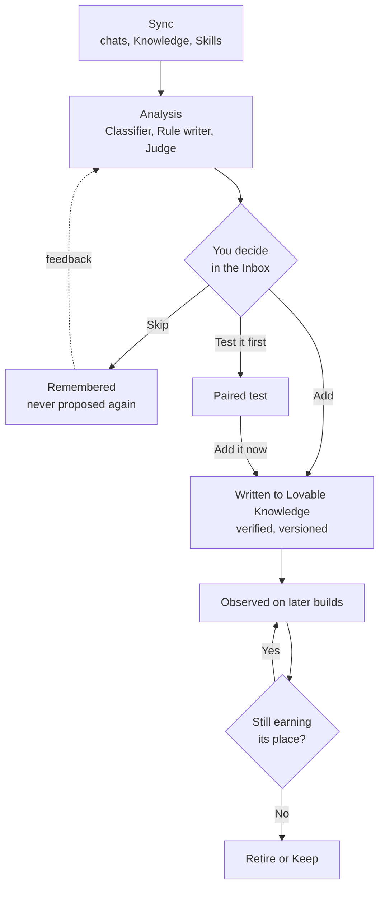
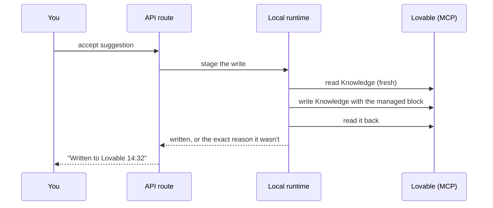

# Harness Ledger

Harness Ledger turns the corrections you give Lovable into standing instructions in your Lovable Knowledge, and then checks whether those instructions actually earn their place.

## Contents

1. [What it is](#1-what-it-is)
2. [How it works](#2-how-it-works)
3. [Proof: paired tests](#3-proof-paired-tests)
4. [Why it runs on your machine](#4-why-it-runs-on-your-machine)
5. [Safety and cost](#5-safety-and-cost)
6. [The app at a glance](#6-the-app-at-a-glance)
7. [Getting started](#7-getting-started)
8. [Architecture](#8-architecture)
9. [Development](#9-development)
10. [Status and roadmap](#10-status-and-roadmap)
11. [FAQ](#11-faq)

---

## 1. What it is

Every time you correct Lovable ("no, use kronor", "don't touch the login page", "sentence case, please") you teach it something. Lovable has a place to keep that lesson permanently, **Knowledge**, but almost nobody maintains it. So the same corrections come back, chat after chat.

Harness Ledger reads your own chat history with Lovable, finds where you corrected it, and proposes one instruction per correction. You decide: add it to this project, add it to all your projects, skip it, or test it first. What you approve is written into your Knowledge inside a marked block that Harness Ledger owns, every version is kept, and anything can be undone. Once a rule is live, Harness Ledger watches your later builds and suggests retiring rules that don't hold up.

Autonomy is available (it can accept confident suggestions for you), but the default is manual. Nothing spends Lovable credits or AI tokens unless you press a button that says so, and every number on screen says where it came from.


---

## 2. How it works

Four words, four different things:

| Word | Meaning | Cost |
|---|---|---|
| **Sync** | Reading your chats, Knowledge and Skills from Lovable (hourly, or "Sync now") | Free |
| **Analysis** | The AI step, on "Analyse now": the **Classifier** finds corrections, the **Rule writer** proposes one instruction per correction, the **Judge** checks later builds against live rules | AI tokens |
| **Suggestion** | A proposed rule you haven't decided on | Free |
| **Rule** | A suggestion you accepted, written to Lovable Knowledge | Free |



**The managed block.** Harness Ledger only ever writes between its own markers; everything else in your Knowledge is preserved byte for byte:

```
<!-- harness:start -->
## Instructions managed by Harness Ledger (edit above this line, not inside)
- Show every money amount in this app in Swedish kronor, e.g. "125 kr".
- Write all UI text in sentence case.
<!-- harness:end -->
```

Every write reads your Knowledge fresh, writes, reads it back, and only counts as done when the read-back matches. If you edited your own text in Lovable meanwhile, the rules are recomposed around it; if someone edited inside the block, the write stops instead of overwriting. Removing the last rule removes the whole block.

**Watching later builds.** For each live rule, Harness Ledger counts the later builds in that rule's area and how many still needed the same correction. The Judge also reads Lovable's replies and records whether the rule was followed, with a quote. It never claims a rule "helped"; it shows what was observed.

**Retiring rules.** A rule is suggested for retirement when more of its builds repeated the correction than didn't, when it hasn't applied in 60 days, when a newer rule contradicts it, or when you ask Lovable for the opposite of what it says. You choose **Retire** or **Keep** (Keep asks again in 30 days).

**A short example.** You tell Lovable "no, not dollars, use kronor". After the next sync, Analyse now classifies that message as a correction and proposes *"Show every money amount in kronor."* You press **Add to this project**: it is written to Lovable Knowledge within seconds and shows "Written to Lovable 14:32". Weeks later you ask Lovable to switch to euros; Harness Ledger notices the message goes against the live rule and offers to retire it, quoting your message.

---

## 3. Proof: paired tests

A paired test answers "would this rule have avoided my correction?" on a real build:

1. Harness Ledger copies your project as it was **just before** the original request and puts only this rule in the copy's Knowledge.
2. It sends the copy the same request, and records Lovable's summary, reply, diff, a screenshot and the exact credit cost Lovable reports.
3. Optionally (on by default, free) it also copies your project **right after** the original request, so you can open your real original build next to the new one.
4. Both builds stay in your workspace as normal Lovable projects you can open and keep building on, until you delete them.

You judge on one screen, for each correction the rule came from: **Still needed? Yes / No / Unclear**.


What it does not prove:

- **One build is evidence, not proof.**
- **Lovable's project memory is copied as it is today.** In the screenshot above, the rebuilt copy came out in euros and lowercase, preferences given to Lovable after the replayed request. The judging screen says so.
- **Screenshots only prove visual rules.** "Don't break login" needs a behavioural check, which is on the roadmap.

---

## 4. Why it runs on your machine

The goal was to run Harness Ledger inside Lovable as a hosted app. That isn't possible today: there is no public Lovable API that lets a third-party hosted app read a user's chats and write their Knowledge, and Lovable's authorization server rejected the hosted OAuth client ("Client Not Found").

So Harness Ledger runs locally, with its own Lovable login:

- **OAuth on your machine.** The local runtime registers with Lovable's authorization server and completes the login through a listener on `127.0.0.1:8765`. Tokens stay in `harness/data/lovable-auth.json` (mode 0600).
- **Lovable MCP** (`mcp.lovable.dev`) for reading chats, Knowledge and Skills, and writing Knowledge.
- **Lovable REST API** (`api.lovable.dev`) for paired tests: copying a project, sending the request, reading the result, deleting the copy.

The web app itself was built with Lovable (TanStack Start, React, shadcn/ui, Supabase auth). Its hosted deployment shows a "runs on your machine" message, and the hosted OAuth client document is already in place for the day Lovable supports that flow.

---

## 5. Safety and cost

- **Lovable credits** are spent only by starting a paired test. There is a monthly budget (default 12), one test runs at a time, and the recorded cost is Lovable's own figure. In this project's testing a small build cost 0.3–0.8 credits.
- **AI tokens** are spent only by Analyse now, within a monthly token budget checked before every call. Providers: OpenAI, Anthropic or Google with your key, or **Claude Code** on your own subscription.
- **Analyse now only processes what's new:** unread messages, corrections without a suggestion, builds not yet checked.
- **Keys and tokens** never go into the database or logs.
- **Everything is reversible:** Undo before a write, Remove from Knowledge and Re-add after, and in History "Undo this change" / "Go back to before this change". Going back refuses if Knowledge was edited in Lovable since, so your edits are never lost.
- **Privacy:** chat text leaves your machine only to the AI provider you chose, only during Analyse now. There is no Harness Ledger server.

---

## 6. The app at a glance

| Page | What it's for |
|---|---|
| **Inbox** | Only what needs a decision, with Add / Skip / Test buttons on each card, and Analyse now with live progress |
| **Suggestions** | Every suggestion with its evidence; edit wording before adding |
| **Instructions** | What is in your Knowledge now, per project and workspace, with each rule's observed health and your verdict |
| **History** | A timeline of every write, decision, skill change and test, with diffs and "Undo this change" |
| **Tests** | Every paired test: project, status, cost, links to the builds, your notes |
| **Skills** | Your workspace Skills and how they changed (read-only) |
| **Projects** | Connect Lovable, choose which projects Harness Ledger may read, per-project limits |
| **Settings** | Ask or automatic decisions, evidence sources, credit and token budgets, sync schedule, AI provider |


---

## 7. Getting started

You need Node `>=22.12` (`nvm install && nvm use`), a Lovable account, and, for the zero-setup AI option, the `claude` CLI.

```sh
npm i
npm run harness:install
npm run harness:build
HARNESS_RUNTIME=local HARNESS_DB_PATH=harness/data/harness.db npm run dev
```

Then:

1. Sign in.
2. **Projects › Connect Lovable** and approve in the browser. On a remote dev machine, forward port **8765** first (the login callback listens on the machine running the app).
3. Switch on the projects Harness Ledger may read, and press **Sync now**.
4. **Settings › AI analysis:** pick a provider (Claude Code needs no key).
5. **Inbox › Analyse now**, then decide.

Restart the dev server after `npm run harness:build`. Without a browser: `npm run harness:executor -- --connect | --status | --once | --analyse | --disconnect`. Demo data: `npm run harness:demo -- --add | --remove` (remove it before writing real rules).

If `npm run dev` fails with a `styleText` error, or signed-in pages fail with "native WebSocket not found", your Node version is too old. After switching Node versions, run `npm run harness:install` again (`better-sqlite3` is a native module).

---

## 8. Architecture

Two halves that deliberately don't share a runtime:

```
src/                          web app (TanStack Start, React, shadcn/ui, Supabase auth)
  routes/_authenticated/      Inbox, Suggestions, Instructions, History, Tests, Skills,
                              Projects, Settings, judging screen
  routes/api/public/harness/  the only server routes the pages may call (checked by a test)
  lib/server/harness-runtime.ts  loads harness/dist only when HARNESS_RUNTIME=local
  lib/harness-ux.ts           product copy and presentation logic

harness/                      local runtime (Node, SQLite via better-sqlite3)
  src/adapter.ts              the only module the web app imports
  src/store.ts, migrations.ts all SQL, schema v1-v17
  src/knowledge.ts            managed block: compose, hash, size cap
  src/improvements.ts         suggestions, rules, versions and every decision action
  src/executor/               Lovable OAuth, MCP client, REST client, sync and write
                              beats, paired-test runner and queue, schedule lock, CLI
  src/analysis/               classify, segment, propose (Rule writer), adherence
                              (Judge), health, retire, run
  src/llm/                    OpenAI, Anthropic, Google and Claude Code clients, budget
```

**Why the split.** The hosted build (Cloudflare via Nitro) can't load native Node modules, so `harness/` is compiled separately and imported only when `HARNESS_RUNTIME=local`. The web app reaches it through one adapter with typed inputs, never raw SQL.

**One sync pass:** read new chat messages for each allowed project (stopping at the first one already stored), snapshot Knowledge and Skills when they changed, run any pending writes, recompute rule health.

**One analysis pass:** classify new messages, group them into task episodes, ask the Rule writer once per uncovered correction, auto-accept if you turned that on, let the Judge check unjudged builds, recompute health and retirement suggestions. Each step reports progress to the Inbox.

**What happens when you press "Add to this project":**



The same read, write, read-back shape is used for Remove, Re-add, wording changes and going back in History.

**Data.** One SQLite file holds synced messages, classifications, task episodes, suggestions, rules and their revisions, every Knowledge snapshot and version, rule health, verdicts and Judge findings, retirement proposals, paired tests and their credit costs, and every analysis run and model call.

---

## 9. Development

```sh
cd harness && npm test          # 700+ tests, no network: fake Lovable server and fake LLM
npm run typecheck               # web app (and `npm run typecheck` in harness/)
npm run build                   # production build
cd harness && npm run llm:smoke # one real model call, after changing harness/src/llm
```

Besides behaviour tests, a set of structural tests reads the page source and pins product copy and rules (for example, that pages only call the allowed routes). A copy change updates its test on purpose.

---

## 10. Status and roadmap

**Working today:** sync, analysis with all three roles, manual and automatic decisions, verified and versioned Knowledge writes with undo, retirement suggestions, paired tests with both builds kept as projects, live analysis progress, History, Tests, Skills.

**Next:**

- **Behavioural checks** for non-visual rules, run against both test copies (e.g. sign in on each).
- **A fairer test copy**, without Lovable's later project memory.
- **A scoreboard** across rules and projects, once there are weeks of builds.
- **Hosted mode**, as soon as Lovable offers an API for third-party apps.

---

## 11. FAQ

**Does it change my code?** No. It only writes Lovable Knowledge, inside its own block.

**Can it break my Knowledge?** Every write is verified by reading it back, nothing outside the block is touched, every version is kept, and History can take you back.

**What does a test cost?** One normal Lovable build; the copies themselves are free. The cost Lovable reports is recorded, and a monthly budget stops tests before they overspend.

**What if I edit Knowledge in Lovable myself?** Your own text is kept, and changes inside Harness Ledger's block are never overwritten.

**Does it work across projects?** Yes: add a rule to one project or to your whole workspace. Harness Ledger warns you when a rule meant for all projects talks about "this app".

---

No license has been chosen yet; all rights reserved by the author. Built with [Lovable](https://lovable.dev) and [Claude Code](https://claude.com/claude-code).
