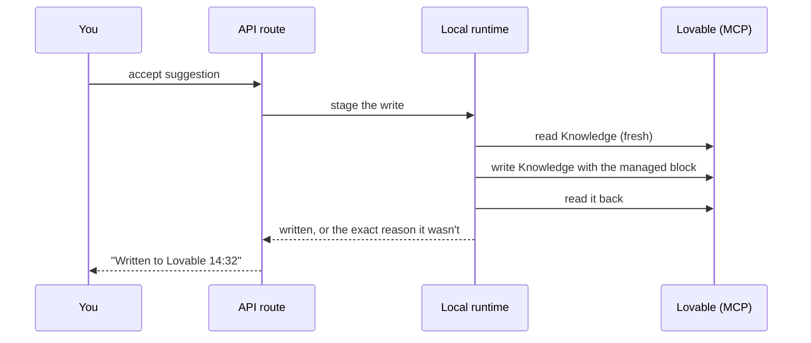

# Harness Ledger

**Teach Lovable once. Keep the lesson.**

Every time you correct Lovable ("no, use kronor", "keep the login page", "sentence case, please") you teach it something. Lovable can keep that lesson in **Knowledge** (standing instructions) or a **Skill** (a procedure for a kind of task). Almost nobody maintains them, so the same corrections come back chat after chat.

Harness Ledger learns from the corrections you give Lovable, turns reusable lessons into Knowledge or Skills, and helps you decide whether those instructions should remain.

**The loop:** Correct Lovable → Harness Ledger finds the lesson → Review Knowledge or Skill → Test if desired → Add to Lovable → Observe, revise or restore.

**Status:** a local prototype. Knowledge works end to end; Skills are first-class locally and can be published to Lovable as new workspace Skills (create only — never updated or deleted); the historical replay works; paired comparison and behavioural checks are planned; hosted authorization is blocked pending an approved hosted path. Nothing spends Lovable credits or AI tokens unless you press a button that says so.

**Start here:** [Getting started](#3-getting-started) (about ten minutes if Node.js and an AI provider are already set up), then open the app, connect Lovable, choose projects, pick Ask me first, pick a provider, and press Analyse now.

## Contents

1. [What you do, and what Harness Ledger does](#1-what-you-do-and-what-harness-ledger-does)
2. [What it shows you](#2-what-it-shows-you)
3. [Getting started](#3-getting-started)
4. [Test a rule against a previous correction](#4-test-a-rule-against-a-previous-correction)
5. [Knowledge and Skills](#5-knowledge-and-skills)
6. [Sync, Analyse and Reanalyse history](#6-sync-analyse-and-reanalyse-history)
7. [Ask me first or Automatic](#7-ask-me-first-or-automatic)
8. [Safety, cost and privacy](#8-safety-cost-and-privacy)
9. [Use Harness Ledger through MCP](#9-use-harness-ledger-through-mcp)
10. [Why it runs on your machine](#10-why-it-runs-on-your-machine)
11. [Architecture](#11-architecture)
12. [Development](#12-development)
13. [Status](#13-status)
14. [FAQ](#14-faq)

---

## 1. What you do, and what Harness Ledger does

You set it up once:

1. Connect Lovable.
2. Choose projects.
3. Choose **Ask me first** or **Automatic**.
4. Pick an AI provider.
5. Press **Analyse now** after new activity (or let Sync run hourly).

After that, **Inbox contains everything that needs your attention**: new instructions, new Skills, test results waiting for your verdict, rules needing attention, conflicts and failed actions — and when none of that is waiting, the one next action instead (connect, choose projects, choose a provider, analyse, or sync). Everything else is a record: Instructions holds accepted Knowledge, Skills holds the Skill inventory and proposals, Tests holds replay evidence, History holds completed decisions and changes.

Every suggestion card says what was found, what Harness Ledger recommends, why in one sentence, what to do, and whether Lovable, Lovable credits or AI tokens are affected. Explanations sit on the same page; raw classifications, model metadata, remote ids and full diffs are collapsed under "Technical details".

**The managed block.** Knowledge is only ever written between Harness Ledger's own markers; everything else in your Knowledge is preserved byte for byte:

```
<!-- harness:start -->
## Instructions managed by Harness Ledger
<!-- Manage this section in Harness Ledger. Manual edits cause a conflict and are never overwritten automatically. -->
- Show every money amount in this app in Swedish kronor, e.g. "125 kr".
- Write all UI text in sentence case.
<!-- harness:end -->
```

Every write reads your Knowledge fresh, compares it with what Harness Ledger last wrote, writes, reads it back, and only counts as done when the read-back matches exactly. A manual edit inside the block stops the write with a conflict. Removing the last rule removes the whole block.

---

## 2. What it shows you

| Page             | What it answers                                                                                                                                                                               |
| ---------------- | --------------------------------------------------------------------------------------------------------------------------------------------------------------------------------------------- |
| **Inbox**        | Is Harness Ledger ready? Do I need to do anything? Everything that needs your attention: New instruction, New Skill, Test result, Rule needs attention, Conflict, Action failed. One primary action per item, or the one next action when nothing does; a suggestion opens its detail page |
| **Instructions** | Rules needing attention first, then Knowledge per project and workspace, then Skills. "Is this rule still useful?" with Keep / Review / Retire / Not sure                                     |
| **Skills**       | Skills in Lovable, and Skill proposals you can publish to Lovable as new Skills                                                                                                               |
| **Tests**        | Every replay: kind, evidence strength, conclusion, cost                                                                                                                                       |
| **History**      | Current Knowledge, then the audit timeline filtered by Suggestions, Knowledge, Skills, Tests or Restores; past decisions live here, not in Inbox                                              |
| **Projects**     | Connect Lovable, choose which projects Harness Ledger may read                                                                                                                                |
| **Settings**     | Decision mode, evidence sources, budgets, sync schedule, automatic analysis, AI provider and a provider test                                                                                  |


---

## 3. Getting started

It takes about ten minutes. Everything runs on your computer, and the only outside services are Lovable and the AI provider you pick.

### What you need

|                                                                                                                                                                      | Why                                    |
| -------------------------------------------------------------------------------------------------------------------------------------------------------------------- | -------------------------------------- |
| **Node.js 22.12 or newer** (the repo pins `22.23.2` in `.nvmrc`)                                                                                                     | Runs the app and the local runtime     |
| **A Lovable account** with at least one project you've chatted with                                                                                                  | That's where the corrections come from |
| **An AI provider**: either the [Claude Code](https://claude.com/claude-code) CLI, installed and signed in (no key needed), or an OpenAI, Anthropic or Google API key | Only used when you press Analyse now   |
| **A web browser** on the same machine                                                                                                                                | To approve the Lovable login           |

### Step 1: Install and start

The repo has two parts, installed separately: the web app at the root, and the local runtime in `harness/` (its own Node package, with a native SQLite module, compiled before the app can load it). `npm run setup` does both for you.

Harness Ledger currently has a developer-oriented local setup. If Node.js and an AI provider are already configured, setup usually takes around ten minutes.

```sh
git clone https://github.com/Saddeee/harness-ledger-foundation.git
cd harness-ledger-foundation
nvm install && nvm use          # or install Node 22.12+ another way

npm run setup                   # installs both packages, builds the local runtime, checks your setup
npm run harness:start           # starts the app
```

Open the address it prints, normally **http://127.0.0.1:8080** (Vite picks the next free port if 8080 is taken). Keep this terminal running.

`npm run setup` prints a line for each step (Node version, installs, build, database, Lovable connection, AI provider) and tells you what to fix if one fails. `npm run harness:start` sets `HARNESS_RUNTIME=local` and a repo-local `HARNESS_DB_PATH` for you, and keeps the dev server bound to `127.0.0.1` unless you set `DEV_HOST_OPEN=1` yourself.

#### Lower-level commands (troubleshooting)

`npm run setup` and `npm run harness:start` are wrappers around these commands. Run them directly if you want to retry a single step:

```sh
npm install                     # the web app
npm run harness:install         # the local runtime
npm run harness:build           # compile the local runtime

HARNESS_RUNTIME=local HARNESS_DB_PATH="$PWD/harness/data/harness.db" npm run dev
```

- `HARNESS_RUNTIME=local` switches on the local runtime. Without it the pages only say "available when Harness Ledger runs on your machine".
- `HARNESS_DB_PATH` is where your data lives: one SQLite file, created on first start and ignored by git.

### Step 2: Create your app account

On the sign-in page, open **Sign up**, enter any email and password, and press **Create account**. This sign-in is inherited from the hosted-capable Lovable foundation the interface was built on; it only unlocks the app's pages. It is not your Lovable login, and your chats, rules, versions and tests stay in the local SQLite file. A packaged local edition may replace this step with a local-only unlock later.

### Step 3: Connect Lovable

1. Go to **Projects** and press **Connect Lovable**.
2. A new tab opens Lovable's login. Sign in and approve access. If no tab opens, use the **Open it here** link that appears under the button.
3. The page shows you as connected, with a list of your Lovable projects.

The login returns to `127.0.0.1:8765` on the computer running the app. If you run the app on a remote machine, forward both the app port and 8765 first (`ssh -L 8080:127.0.0.1:8080 -L 8765:127.0.0.1:8765 your-server`).

### Step 4: Choose projects and sync

1. On **Projects**, switch on the projects Harness Ledger may read. Nothing else is touched.
2. Press **Sync now**. Your chats, Knowledge and Skills are read. Sync uses no credits and no AI tokens, and repeats every hour while the app runs.

### Step 5: Pick an AI provider

In **Settings › AI analysis**, choose **Claude Code (your subscription)**, or choose OpenAI, Anthropic or Google and paste your key. Press **Save AI analysis**. Keys are stored in a local file (mode 0600), never in the database.

### Step 6: Analyse and decide

The first visit opens a short onboarding that walks through these steps and offers **Use recommended settings** (Ask me first, hourly Sync on, automatic analysis after Sync off).

1. Go to **Inbox** and press **Analyse now**. A progress bar shows each step: reading your new messages, grouping them into tasks, writing suggestions, checking your rules against recent builds.
2. Each Inbox card shows the lesson, the proposed instruction, its destination and reason, and one primary action. Choose **Add to this project**, **Add to all my projects**, **Skip**, or **Test this rule** first (a historical replay, see [Test a rule](#4-test-a-rule-against-a-previous-correction); it runs one real Lovable build, so it uses credits).
3. An added rule appears in your Lovable Knowledge within seconds, and on **Instructions** and **History** here.

That's the whole loop. From then on: chat with Lovable as usual, and press Analyse now whenever you want new suggestions.

### Trying it without a Lovable account

`npm run harness:demo -- --add` loads sample projects, suggestions and history so you can click around. Remove it with `npm run harness:demo -- --remove` **before** connecting a real account.

### Command line (optional)

Everything above also works without the browser (and see [Use Harness Ledger through MCP](#9-use-harness-ledger-through-mcp)). Run these from the repo root. They don't need `HARNESS_RUNTIME` (that only switches on the web app's local mode), and without `HARNESS_DB_PATH` they use the same `harness/data/harness.db`:

```sh
npm run harness:executor -- --connect      # Lovable login
npm run harness:executor -- --status       # connection, projects, last sync
npm run harness:executor -- --once         # one sync
npm run harness:executor -- --analyse      # one analysis
npm run harness:executor -- --disconnect   # forget the Lovable login
```

### Troubleshooting

| You see                                                                                        | Fix                                                                                                     |
| ---------------------------------------------------------------------------------------------- | ------------------------------------------------------------------------------------------------------- |
| Pages say "available when Harness Ledger runs on your machine"                                 | Run `npm run setup` then `npm run harness:start` (this sets `HARNESS_RUNTIME=local` for you)            |
| `npm run dev` fails with a `styleText` error, or "native WebSocket not found" after signing in | Node is too old: switch to 22.12+ and run `npm run harness:install` again                               |
| An error mentioning `better-sqlite3` or `NODE_MODULE_VERSION`                                  | You changed Node versions: run `npm run harness:install` again                                          |
| Changes to `harness/` don't show up                                                            | Run `npm run harness:build`, then restart `npm run dev`                                                 |
| Connect Lovable never finishes                                                                 | The browser must reach `127.0.0.1:8765` on the machine running the app; forward the port if it's remote |
| Analyse now says Claude Code was not found                                                     | Install the `claude` CLI and sign in once in a terminal, or pick another provider                       |
| Two copies of the app, but only one syncs                                                      | Only one running app holds the sync schedule at a time (`harness/data/executor.lock`); stop the other   |

---

## 4. Test a rule against a previous correction

The available test is a **historical replay**. It answers: "Would the original correction still be needed in the replay?"

1. Harness Ledger copies your project as it was **just before** the original request.
2. It puts the Project Knowledge that was in force at that time (from its own snapshot history) plus the candidate rule into the copy. The rules that were live then stay; the candidate is the only addition.
3. It sends the copy the same request and records Lovable's summary, reply, diff, a screenshot and the credit cost Lovable reports.
4. Optionally (on by default) it also copies your project right after the original request, so **What Lovable built before** can be opened next to **Rebuilt with the rule**.

You judge per correction: **Yes / No / Unclear**. The page also shows the **replay environment**: code state, Project Knowledge and how it was chosen (exact version, nearest earlier version, today's Knowledge, or none on file), Workspace Knowledge, Skills, chat history, the candidate, other active rules, and the uncontrolled context. Every historical replay is labelled a **historical approximation**: the historical result ran in a different Lovable environment, and Lovable's own project memory, workspace Knowledge, Skills and builder version come from today. It is evidence about the correction, not proof that the rule alone caused any difference.

Creating project copies currently uses no Lovable builder credits. Running a Lovable build in a copy consumes normal builder credits. Copies stay in your workspace until you delete them (Settings › "Keep test builds as projects", on by default); a failed test's copies are always deleted; if a delete fails the copy is set private and the page says so. Screenshots stay after a copy is deleted.

**Not implemented yet: paired comparison.** Two fresh builds from the same historical state, a control without the rule and a treatment with it, both in today's Lovable, so the rule is the intended difference. See [Status](#13-status).

---

## 5. Knowledge and Skills

|         | Knowledge                                                  | Skills                                  | Knowledge plus Skill                                       |
| ------- | ---------------------------------------------------------- | --------------------------------------- | ---------------------------------------------------------- |
| Use for | Short standing rules and project context, always available | Task-specific procedures and checklists | A short reminder in Knowledge pointing to a detailed Skill |

Every suggestion shows the **recommended destination**, why, and the alternative; you can change it. A Skill proposal is a draft SKILL.md you can edit, approve, retire, or restore from any revision.

Exact status of Skills today:

| Capability                                                                            | Status                                                                                                                |
| ------------------------------------------------------------------------------------- | --------------------------------------------------------------------------------------------------------------------- |
| Read workspace Skills and keep their history (with deletions)                         | Working                                                                                                               |
| Propose a Skill from a correction; edit; approve; version; restore a revision; retire | Working, locally                                                                                                      |
| Publish an approved Skill proposal to Lovable as a new workspace Skill                | Working (create only; verified with one live write on 2026-09-19)                                                     |
| Update or delete a Skill already in Lovable, including one Harness Ledger published   | Not wired                                                                                                             |
| Enable or disable a Skill for selected projects                                       | Not wired (workspace Skills apply to every project; Lovable's per-project switch is for Skills inside a project repo) |
| Test a Skill in a replay; observe whether a Skill was followed                        | Not implemented                                                                                                       |

User-owned Skills are protected: Harness Ledger never edits a Skill it did not create, and it never updates or deletes any Skill in Lovable, including ones it published itself.

---

## 6. Sync, Analyse and Reanalyse history

- **Sync** reads what is new in Lovable (messages, Knowledge, Skills, project names) and stores it locally. It stops at the first message it already has. No credits, no AI tokens.
- **Analyse now** looks only at what is new or was invalidated: new messages, corrections without a suggestion, and builds not yet checked against a rule. When a new message refers to something said earlier, older messages are read as context without being processed as new work. Uses AI tokens; changes nothing in Lovable.
- **Reanalyse history** is a separate action you scope yourself: projects, a date range, whether to include records you already decided on, and a reason. You see an estimate before confirming. A decision you made is never replaced silently; if the new result disagrees, a review item appears in the Inbox.
- **Automatic Sync** (hourly while the app runs) and **automatic Analysis after Sync** are separate settings. The second is off by default, so scheduled Sync never spends AI tokens unless you turn it on.

---

## 7. Ask me first or Automatic

Both modes sync, analyse and recommend.

**Ask me first** waits for approval before persistent or credit-spending actions.

**Automatic** performs only the actions, projects and budgets the user has allowed: it accepts a suggestion when the analysis is confident enough, no similar or conflicting rule exists, and the project is under its limits and allows automatic writes. Retirements and Skill changes are never automatic, and everything done automatically is listed in History.

More capable models may improve automation, but autonomy is earned through observed reliability, not assumed from the model name.

Planned, not available yet: per-Skill permissions, frequency limits and risk restrictions.

---

## 8. Safety, cost and privacy

- **Lovable credits** are spent only by starting a replay. There is a monthly budget (default 12), one replay runs at a time, and the recorded cost is Lovable's own figure.
- **AI tokens** are spent only by Analyse now or Reanalyse history, within a monthly token budget checked before every call. Providers: OpenAI, Anthropic or Google with your key, or **Claude Code** on your own subscription.
- **Reversible:** Undo before a write, Remove from Knowledge and Re-add after, and in History "Restored Knowledge from version N" with the reason, actor and the rules added or removed. Restoring refuses if Knowledge was edited in Lovable since, so your edits are never lost.
- **Privacy:** Synced project data is stored locally. During analysis, selected chat, build, Knowledge and Skill context is sent only to the AI provider you configured. During a replay, the historical prompt and configured instruction context are sent to Lovable inside temporary project copies. Harness Ledger does not operate its own remote analysis service. Screenshots and diffs are not sent to the AI Judge (it reads Lovable's reply text). Model calls are logged with token counts, never with prompt or response text.
- **Credentials:** the Lovable token lives in `harness/data/lovable-auth.json` and provider keys in `harness/data/llm-keys.json`, both mode 0600 in a 0700 directory, never in SQLite, responses or logs. Chat text is scrubbed of secrets before it is stored.
- **The app account:** the interface retains the sign-in system from the hosted-capable Lovable foundation. Signing in creates an account and default settings in that hosted Supabase project; operational Harness data (chats, rules, versions, tests) remains in local SQLite. A future packaged local edition may replace this sign-in step with a local-only unlock.

---

## 9. Use Harness Ledger through MCP

Lovable MCP lets Harness Ledger operate Lovable. Harness Ledger MCP lets your agent operate Harness Ledger.

The web UI is not mandatory. Harness Ledger MCP is a local MCP server (`harness/src/mcp-server.ts`, registered in `.mcp.json`) that exposes the same actions as the app, through the same code paths, with the same project allowlist, decision mode, budgets, ownership rules, versioning and audit. It is not a privileged bypass: a tool that would spend credits refuses in exactly the cases the button would.

Implemented and covered by tests (in-memory MCP protocol tests; a budget-parity test proves `start_replay` refuses exactly as the button does):

| Tool                        | What it does                                                                                                                                                         |
| --------------------------- | -------------------------------------------------------------------------------------------------------------------------------------------------------------------- |
| `health`                    | Local service health and the database path                                                                                                                           |
| `list_suggestions`          | Suggestions (open, decided or all) with rule text, correction, destination and status line                                                                           |
| `explain_suggestion`        | One suggestion in full, with the Knowledge preview for its destination                                                                                               |
| `decide_suggestion`         | Accept to the project or workspace, skip with a reason, test it first, or change the wording. Writes Knowledge exactly like the button, or refuses in the same words |
| `list_rules`                | Active and retired rules per project and workspace                                                                                                                   |
| `list_skills`               | The workspace's current Skill snapshots                                                                                                                              |
| `start_replay`              | Queue a historical replay for a suggestion; refuses when not connected, already running, or over budget                                                              |
| `get_replay`                | One replay in full: both sides, environment record, verdicts                                                                                                         |
| `list_replays`              | Every replay, summarised                                                                                                                                             |
| `list_knowledge_versions`   | Knowledge write history for a project or the workspace                                                                                                               |
| `restore_knowledge_version` | Restore a version through the same fresh-read, compare, read-back path                                                                                               |
| `rule_observations`         | A rule's observed and AI-review counts and your latest verdict                                                                                                       |
| `timeline`                  | The History timeline for a target                                                                                                                                    |

Run it from a Claude Code session in this repo (the `.mcp.json` entry points at your local database) or any MCP client with `npx tsx harness/src/mcp-server.ts`.

---

## 10. Why it runs on your machine

The Lovable operations Harness needs are available through Lovable's MCP and API surfaces. The current limitation is hosted authorization. The hosted prototype could not complete an approved application-to-Lovable sign-in flow, while the local runtime can authenticate through a localhost callback. Harness therefore runs its operational workflow locally today. The Lovable-hosted application remains the hosted product preview and preserves the hosted adapter for a future approved authorization path.

Local and hosted execution are adapters around shared product logic:

- **Local runtime:** registers with Lovable's authorization server and completes the login through a listener on `127.0.0.1:8765`. Uses **Lovable MCP** (`mcp.lovable.dev`) to read chats, Knowledge and Skills and to write Knowledge, and the **Lovable REST API** (`api.lovable.dev`) for replays: copying a project, sending the request, reading the result, deleting a copy.
- **Hosted preview:** the same web app deployed by Lovable, showing the product; its pages say the workflow runs on your machine.

Technical detail: Lovable's authorization server answered the hosted OAuth client registration with "Client Not Found". The hosted OAuth routes remain in the repo, unused.

---

## 11. Architecture

Two halves that deliberately don't share a runtime:

```
src/                          web app (TanStack Start, React, shadcn/ui, Supabase auth)
  routes/_authenticated/      Inbox, Instructions, Skills, Tests, History,
                              Projects, Settings, onboarding, judging screen and the
                              suggestion detail (reached from Inbox and History)
  routes/api/public/harness/  the only server routes the pages may call (checked by a test)
  lib/server/harness-runtime.ts  loads harness/dist only when HARNESS_RUNTIME=local
  lib/harness-ux.ts           product copy and presentation logic

harness/                      local runtime (Node, SQLite via better-sqlite3)
  src/adapter.ts              the only module the web app imports
  src/store.ts, migrations.ts all SQL, schema v1-v21
  src/knowledge.ts            managed block: compose, hash, size cap
  src/improvements.ts         suggestions, rules, versions and every decision action
  src/executor/               Lovable OAuth, MCP client, REST client, sync and write
                              beats, replay runner and queue, replay environment record,
                              schedule lock, CLI
  src/analysis/               classify, segment, propose (Rule writer), context packet,
                              reanalyse, adherence (Judge), health, retire, run
  src/mcp-server.ts           Harness Ledger MCP: the same actions as the app, over the adapter
scripts/                      npm run setup and npm run harness:start
  src/llm/                    OpenAI, Anthropic, Google and Claude Code clients, budget
```

**Why the split.** The hosted build (Cloudflare via Nitro) can't load native Node modules, so `harness/` is compiled separately and imported only when `HARNESS_RUNTIME=local`. The web app reaches it through one adapter with typed inputs, never raw SQL.

**One sync pass:** read new chat messages for each allowed project (stopping at the first one already stored), snapshot Knowledge and Skills when they changed, run any pending writes, recompute rule health. It queues an analysis only when "automatic analysis after sync" is on.

**One analysis pass:** classify new messages with a recorded context packet, group them into task episodes, ask the Rule writer once per uncovered correction (destination, wording, Skill draft), auto-accept if you turned that on, let the Judge check unjudged builds, recompute health and review suggestions. Each step reports progress to the Inbox.

**What happens when you press "Add to this project":**



The same read, write, read-back shape is used for Remove, Re-add, wording changes and going back in History.

**Data.** One SQLite file holds synced messages, classifications, task episodes, suggestions, rules and their revisions, every Knowledge snapshot and version, rule health, verdicts and Judge findings, retirement proposals, replays with their environment records and credit costs, and every analysis run and model call.

---

## 12. Development

```sh
cd harness && npm test          # node:test, no network: fake Lovable server and fake LLM
npm run typecheck               # web app (and `npm run typecheck` in harness/)
npm run lint                    # ESLint + Prettier (generated Supabase files are skipped)
npm run build                   # production build (hosted preview; never imports better-sqlite3)
cd harness && npm run llm:smoke # one real model call, after changing harness/src/llm
```

Besides behaviour tests, structural tests read the page source and pin product copy and rules (for example, that pages only call the allowed routes, that the replay is never described as a comparison it is not, that this README's links resolve). A copy change updates its test on purpose.

---

## 13. Status

The source of truth is the capability manifest in `harness/src/capabilities.ts` (mirrored for the web app in `src/lib/capabilities-copy.ts`); a test fails when a capability marked working has no verification reference, and the landing page's claims are checked against it.

### Working in the local prototype

- Lovable connection, incremental Sync, Analysis (Classifier, Rule writer with destination and Skill drafts, Judge), Reanalyse history.
- Knowledge proposal, verified and versioned Knowledge writes, undo, remove, re-add and restore.
- Historical replay with the environment record, evidence strength and a derived conclusion.
- Rule observation: observed repeat corrections and AI review reported separately; Keep / Review / Retire / Not sure.
- Local Skill proposals: propose, edit, approve, version, restore, retire.
- Publish an approved Skill proposal to Lovable as a new workspace Skill (create only; verified with one live write on 2026-09-19).
- Harness Ledger MCP with the same permissions as the app.
- One-command setup; onboarding; Inbox with one next action; OpenAI parameter compatibility with a provider test.

### Current limitations

- Remote Skill publishing creates a new Skill only; updating, enabling, disabling or restoring a Skill in Lovable is not wired.
- Paired comparison (fresh control and treatment) is planned.
- Behavioural verification (for example, that a login route still works) is planned; screenshots show visual results only.
- Historical context is reconstructed from Harness Ledger's own snapshots; a change made in Lovable between two syncs is only visible from the next snapshot, and Lovable's project memory, Workspace Knowledge and Skills at the time cannot be restored.
- Hosted authorization is blocked pending an approved hosted path; the workflow runs locally, with a developer-oriented setup and the hosted app account.
- Diffs and edits are not synced, so the Rule writer does not see a diff summary.
- The replay's copy deletion reads as "requested" until Lovable confirms it no longer lists the copy.

### Next

- Updating or deleting a Skill already in Lovable, including one Harness Ledger published itself.
- Paired comparison: two fresh builds per test, with the same environment record per arm.
- Behavioural checks against replay copies.
- Sync of edits and diffs; a packaged local edition with a local-only unlock instead of the hosted sign-in.

---

## 14. FAQ

**Does it change my code?** No. It only writes Lovable Knowledge, inside its own block, and can publish an approved Skill proposal as a new workspace Skill — it never updates or deletes a Skill, in Lovable or one you wrote yourself.

**Can it break my Knowledge?** Every write is read back and compared exactly, nothing outside the block is touched, a manual edit inside the block stops the write, every version is kept, and History can restore any of them.

**What does a replay cost?** Creating project copies currently uses no Lovable builder credits. Running a Lovable build in a copy consumes normal builder credits. The cost Lovable reports is recorded, and a monthly budget stops replays before they overspend.

**What if I edit Knowledge in Lovable myself?** Your own text is kept, and changes inside Harness Ledger's block are never overwritten.

**Does it work across projects?** Yes: add a rule to one project or to your whole workspace. Harness Ledger warns you when a rule meant for all projects talks about "this app".

---

No license has been chosen yet; all rights reserved by the author. Built with [Lovable](https://lovable.dev) and [Claude Code](https://claude.com/claude-code).
