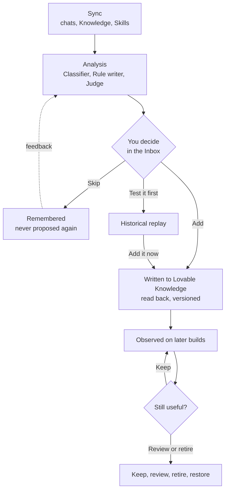
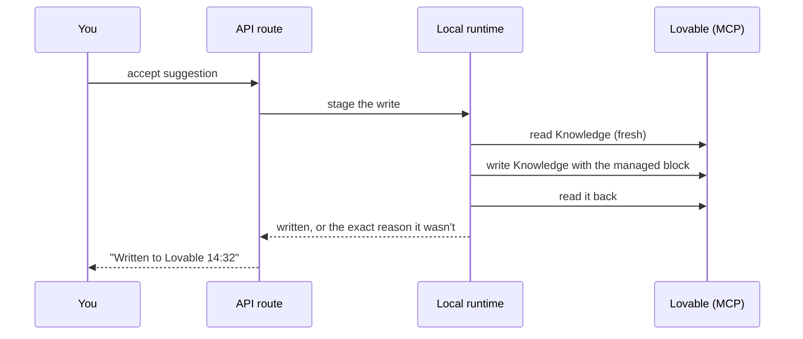

# Harness Ledger

Harness Ledger turns the corrections you give Lovable into versioned Knowledge and Skills, then collects evidence about whether those instructions still deserve to remain.

It creates an evidence trail from correction to persistent instruction, lets you replay the original task, observes later relevant builds, and keeps the instruction lifecycle reversible.

**New here?** Read [What it is](#1-what-it-is) and [How it works](#2-how-it-works), then follow [Getting started](#8-getting-started).

## Contents

1. [What it is](#1-what-it-is)
2. [How it works](#2-how-it-works)
3. [Test a rule against a previous correction](#3-test-a-rule-against-a-previous-correction)
4. [Knowledge and Skills](#4-knowledge-and-skills)
5. [Sync, Analysis and Reanalyse history](#5-sync-analysis-and-reanalyse-history)
6. [Safety, cost and privacy](#6-safety-cost-and-privacy)
7. [The app at a glance](#7-the-app-at-a-glance)
8. [Getting started](#8-getting-started)
9. [Use Harness Ledger through MCP](#9-use-harness-ledger-through-mcp)
10. [Why it runs on your machine](#10-why-it-runs-on-your-machine)
11. [Architecture](#11-architecture)
12. [Development](#12-development)
13. [Status](#13-status)
14. [FAQ](#14-faq)

---

## 1. What it is

Every time you correct Lovable ("no, use kronor", "don't touch the login page", "sentence case, please") you teach it something. Lovable has two places to keep that lesson: **Knowledge**, instructions for a project or your whole workspace that Lovable's agent reads on every request, and **Skills**, procedures it follows for a kind of task. Almost nobody maintains them. So the same corrections come back, chat after chat.

Harness Ledger reads your own chat history with Lovable, finds where you corrected it, and proposes one instruction per correction with a recommended destination: Knowledge, a Skill, or both. You decide: edit it, add it to this project or to all your projects, test it against the original request first, or skip it. What you approve to Knowledge is written inside a marked block that Harness Ledger owns, read back, and versioned; anything can be undone. Once a rule is live, Harness Ledger watches your later builds and asks, with evidence, whether the rule is still useful.

Autonomy is available (it can accept confident suggestions for you), but the default is to ask. Nothing spends Lovable credits or AI tokens unless you press a button that says so, and every number on screen says where it came from.


---

## 2. How it works

| Word                  | Meaning                                                                                                                                                                                                                      | Cost      |
| --------------------- | ---------------------------------------------------------------------------------------------------------------------------------------------------------------------------------------------------------------------------- | --------- |
| **Sync**              | Reading your chats, Knowledge and Skills from Lovable (hourly, or "Sync now"). Incremental: only what is new.                                                                                                                | None      |
| **Analysis**          | The AI step, on "Analyse now": the **Classifier** finds corrections, the **Rule writer** proposes one instruction per correction with a destination, the **Judge** checks later builds against live rules. Only new records. | AI tokens |
| **Reanalyse history** | A separate, scoped pass over older records you choose, with an estimate and a confirmation. Never overwrites a decision you made.                                                                                            | AI tokens |
| **Suggestion**        | A proposed instruction you haven't decided on                                                                                                                                                                                | None      |
| **Rule**              | A suggestion you accepted, written to Lovable Knowledge                                                                                                                                                                      | None      |
| **Skill proposal**    | A draft Skill kept and versioned locally                                                                                                                                                                                     | None      |



**The managed block.** Harness Ledger only ever writes between its own markers; everything else in your Knowledge is preserved byte for byte:

```
<!-- harness:start -->
## Instructions managed by Harness Ledger
<!-- Manage this section in Harness Ledger. Manual edits cause a conflict and are never overwritten automatically. -->
- Show every money amount in this app in Swedish kronor, e.g. "125 kr".
- Write all UI text in sentence case.
<!-- harness:end -->
```

Every write reads your Knowledge fresh, compares it with what Harness Ledger last wrote, composes the block, writes, reads it back, and only counts as done when the read-back matches exactly. If you edited your own text in Lovable meanwhile, the rules are recomposed around it. If someone edited inside the block, the write stops with a conflict instead of overwriting. Removing the last rule removes the whole block. Blocks written under the earlier heading are still recognised as Harness Ledger's own.

**Watching later builds.** For each live rule, Harness Ledger reports two things separately: what it observed ("Harness found the same issue in 2 of 3 relevant builds") and what the AI review found in Lovable's replies ("AI review marked the rule as not followed in 3 of 3 relevant builds", with a quote). It never claims a rule caused an outcome.

**Is this rule still useful?** That is the question on every rule, with **Keep**, **Review**, **Retire** and **Not sure**. Repeated issues open a "Needs attention" recommendation (rewrite the rule or turn it into a Skill). A rule with no relevant task for 60 days opens "Review for relevance", not a retirement. When you ask Lovable for the opposite of a live rule, the message is classified first: a one-task exception or a temporary override is noted; only a permanent change of preference or a genuine contradiction questions the rule.

---

## 3. Test a rule against a previous correction

The available test is a **historical replay**. It answers: "Would the original correction still be needed in the replay?"

1. Harness Ledger copies your project as it was **just before** the original request.
2. It puts the Project Knowledge that was in force at that time (from its own snapshot history) plus the candidate rule into the copy. The rules that were live then stay; the candidate is the only addition.
3. It sends the copy the same request and records Lovable's summary, reply, diff, a screenshot and the credit cost Lovable reports.
4. Optionally (on by default) it also copies your project right after the original request, so the **Historical result** can be opened next to the **Replay with rule**.

You judge per correction: **Yes / No / Unclear**. The page also shows the **replay environment**: code state, Project Knowledge and how it was chosen (exact version, nearest earlier version, today's Knowledge, or none on file), Workspace Knowledge, Skills, chat history, the candidate, other active rules, and the uncontrolled context. Every historical replay is labelled a **historical approximation**: the historical result ran in a different Lovable environment, and Lovable's own project memory, workspace Knowledge, Skills and builder version come from today. It is evidence about the correction, not proof that the rule alone caused any difference.

Creating project copies currently uses no Lovable builder credits. Running a Lovable build inside a copy consumes normal Lovable builder credits. Copies stay in your workspace until you delete them (Settings › "Keep test builds as projects", on by default); a failed test's copies are always deleted; if a delete fails the copy is set private and the page says so. Screenshots stay after a copy is deleted.

**Not implemented yet: paired comparison.** Two fresh builds from the same historical state, a control without the rule and a treatment with it, both in today's Lovable, so the rule is the intended difference. See [Status](#13-status).

---

## 4. Knowledge and Skills

|         | Knowledge                                                  | Skills                                  | Knowledge plus Skill                                       |
| ------- | ---------------------------------------------------------- | --------------------------------------- | ---------------------------------------------------------- |
| Use for | Short standing rules and project context, always available | Task-specific procedures and checklists | A short reminder in Knowledge pointing to a detailed Skill |

Every suggestion shows the **recommended destination**, why, and the alternative; you can change it. A Skill proposal is a draft SKILL.md you can edit, approve, retire, or restore from any revision.

Exact status of Skills today:

| Capability                                                                            | Status                                                                                                                |
| ------------------------------------------------------------------------------------- | --------------------------------------------------------------------------------------------------------------------- |
| Read workspace Skills and keep their history (with deletions)                         | Working                                                                                                               |
| Propose a Skill from a correction; edit; approve; version; restore a revision; retire | Working, locally                                                                                                      |
| Create or update a Skill in Lovable                                                   | Not wired                                                                                                             |
| Enable or disable a Skill for selected projects                                       | Not wired (workspace Skills apply to every project; Lovable's per-project switch is for Skills inside a project repo) |
| Test a Skill in a replay; observe whether a Skill was followed                        | Not implemented                                                                                                       |

User-owned Skills are protected: Harness Ledger never edits a Skill it did not create.

---

## 5. Sync, Analysis and Reanalyse history

- **Sync** retrieves new Lovable data (messages, Knowledge, Skills, project names) and stores it locally with stable remote ids; it stops at the first message it already has and resumes parked cursors.
- **Analysis** sends selected context to the AI provider you configured. Ordinary Analyse now processes only new or changed messages, unclassified follow-ups, corrections without a suggestion, and builds not yet checked against a rule. Older local messages may be read as context for a new message (when it refers to something said earlier) without being analysed or billed again. Every model call records which items it was shown and why.
- **Reanalyse history** is a separate action: choose projects, a date range, whether to include records you already decided on, and a reason; see the estimate; confirm. If a newer analysis disagrees with a decision you made, it opens a review item ("A newer analysis disagrees with your previous decision") instead of changing anything.
- **Automatic Sync** (hourly, while the app runs) and **automatic Analysis after Sync** are separate settings. The second is off by default, so scheduled Sync never spends AI tokens unless you turn it on.

---

## 6. Safety, cost and privacy

- **Lovable credits** are spent only by starting a replay. There is a monthly budget (default 12), one replay runs at a time, and the recorded cost is Lovable's own figure.
- **AI tokens** are spent only by Analyse now or Reanalyse history, within a monthly token budget checked before every call. Providers: OpenAI, Anthropic or Google with your key, or **Claude Code** on your own subscription.
- **Reversible:** Undo before a write, Remove from Knowledge and Re-add after, and in History "Restored Knowledge from version N" with the reason, actor and the rules added or removed. Restoring refuses if Knowledge was edited in Lovable since, so your edits are never lost.
- **Privacy:** Synced project data is stored locally. During analysis, selected chat, build, Knowledge and Skill context is sent only to the AI provider you configured. During a replay, the historical prompt and configured instruction context are sent to Lovable inside temporary project copies. Harness Ledger does not operate its own remote analysis service. Screenshots and diffs are not sent to the AI Judge (it reads Lovable's reply text). Model calls are logged with token counts, never with prompt or response text.
- **Credentials:** the Lovable token lives in `harness/data/lovable-auth.json` and provider keys in `harness/data/llm-keys.json`, both mode 0600 in a 0700 directory, never in SQLite, responses or logs. Chat text is scrubbed of secrets before it is stored.
- **The app account:** the interface retains the sign-in system from the hosted-capable Lovable foundation. Signing in creates an account and default settings in that hosted Supabase project; operational Harness data (chats, rules, versions, tests) remains in local SQLite. A future packaged local edition may replace this sign-in step with a local-only unlock.

---

## 7. The app at a glance

| Page             | What it's for                                                                                                          |
| ---------------- | ---------------------------------------------------------------------------------------------------------------------- |
| **Inbox**        | Only what needs a decision, with Add / Skip / Test on each card; Analyse now with live progress; Reanalyse history     |
| **Suggestions**  | Every suggestion with its evidence, recommended destination and Skill draft; edit before adding                        |
| **Instructions** | Each rule: current status, recommendation, primary action, the instruction, observations, test evidence, versions      |
| **History**      | A timeline per project or workspace: versions, restores, decisions, Skill changes, tests                               |
| **Tests**        | Every replay: kind, evidence strength, status, cost, links to the copies, your notes                                   |
| **Skills**       | Skill proposals (local) and your workspace Skills with their history                                                   |
| **Projects**     | Connect Lovable, choose which projects Harness Ledger may read, per-project limits                                     |
| **Settings**     | Ask or automatic decisions, evidence sources, credit and token budgets, sync schedule, automatic analysis, AI provider |


---

## 8. Getting started

It takes about ten minutes. Everything runs on your computer, and the only outside services are Lovable and the AI provider you pick.

### What you need

|                                                                                                                                                                      | Why                                    |
| -------------------------------------------------------------------------------------------------------------------------------------------------------------------- | -------------------------------------- |
| **Node.js 22.12 or newer** (the repo pins `22.23.2` in `.nvmrc`)                                                                                                     | Runs the app and the local runtime     |
| **A Lovable account** with at least one project you've chatted with                                                                                                  | That's where the corrections come from |
| **An AI provider**: either the [Claude Code](https://claude.com/claude-code) CLI, installed and signed in (no key needed), or an OpenAI, Anthropic or Google API key | Only used when you press Analyse now   |
| **A web browser** on the same machine                                                                                                                                | To approve the Lovable login           |

### Step 1: Install and start

The repo has two parts, installed separately: the web app at the root, and the local runtime in `harness/` (its own Node package, with a native SQLite module, compiled before the app can load it). `npm run setup` does both for you.

Harness Ledger currently has a developer-oriented local setup. If Node.js and an AI provider are already configured, setup usually takes around ten minutes.

```sh
git clone https://github.com/Saddeee/harness-ledger-foundation.git
cd harness-ledger-foundation
nvm install && nvm use          # or install Node 22.12+ another way

npm run setup                   # installs both packages, builds the local runtime, checks your setup
npm run harness:start           # starts the app
```

Open the address it prints, normally **http://127.0.0.1:8080** (Vite picks the next free port if 8080 is taken). Keep this terminal running.

`npm run setup` prints a line for each step (Node version, installs, build, database, Lovable connection, AI provider) and tells you what to fix if one fails. `npm run harness:start` sets `HARNESS_RUNTIME=local` and a repo-local `HARNESS_DB_PATH` for you, and keeps the dev server bound to `127.0.0.1` unless you set `DEV_HOST_OPEN=1` yourself.

#### Lower-level commands (troubleshooting)

`npm run setup` and `npm run harness:start` are wrappers around these commands. Run them directly if you want to retry a single step:

```sh
npm install                     # the web app
npm run harness:install         # the local runtime
npm run harness:build           # compile the local runtime

HARNESS_RUNTIME=local HARNESS_DB_PATH="$PWD/harness/data/harness.db" npm run dev
```

- `HARNESS_RUNTIME=local` switches on the local runtime. Without it the pages only say "available when Harness Ledger runs on your machine".
- `HARNESS_DB_PATH` is where your data lives: one SQLite file, created on first start and ignored by git.

### Step 2: Create your app account

On the sign-in page, open **Sign up**, enter any email and password, and press **Create account**. This account only unlocks the app's pages; it is not your Lovable login, and your chats, rules and history stay in the local SQLite file.

### Step 3: Connect Lovable

1. Go to **Projects** and press **Connect Lovable**.
2. A new tab opens Lovable's login. Sign in and approve access. If no tab opens, use the **Open it here** link that appears under the button.
3. The page shows you as connected, with a list of your Lovable projects.

The login returns to `127.0.0.1:8765` on the computer running the app. If you run the app on a remote machine, forward both the app port and 8765 first (`ssh -L 8080:127.0.0.1:8080 -L 8765:127.0.0.1:8765 your-server`).

### Step 4: Choose projects and sync

1. On **Projects**, switch on the projects Harness Ledger may read. Nothing else is touched.
2. Press **Sync now**. Your chats, Knowledge and Skills are read. Sync uses no credits and no AI tokens, and repeats every hour while the app runs.

### Step 5: Pick an AI provider

In **Settings › AI analysis**, choose **Claude Code (your subscription)**, or choose OpenAI, Anthropic or Google and paste your key. Press **Save AI analysis**. Keys are stored in a local file (mode 0600), never in the database.

### Step 6: Analyse and decide

1. Go to **Inbox** and press **Analyse now**. A progress bar shows each step: reading your new messages, grouping them into tasks, writing suggestions, checking your rules against recent builds.
2. Each suggestion card shows the correction it came from and the recommended destination (Knowledge, Skill or both). Choose **Add to this project**, **Add to all my projects**, **Skip**, or **Test this rule** first (a historical replay, see [Test a rule](#3-test-a-rule-against-a-previous-correction); it runs one real Lovable build, so it uses credits).
3. An added rule appears in your Lovable Knowledge within seconds, and on **Instructions** and **History** here.

That's the whole loop. From then on: chat with Lovable as usual, and press Analyse now whenever you want new suggestions.

### Trying it without a Lovable account

`npm run harness:demo -- --add` loads sample projects, suggestions and history so you can click around. Remove it with `npm run harness:demo -- --remove` **before** connecting a real account.

### Command line (optional)

Everything above also works without the browser (and see [Use Harness Ledger through MCP](#9-use-harness-ledger-through-mcp)). Run these from the repo root. They don't need `HARNESS_RUNTIME` (that only switches on the web app's local mode), and without `HARNESS_DB_PATH` they use the same `harness/data/harness.db`:

```sh
npm run harness:executor -- --connect      # Lovable login
npm run harness:executor -- --status       # connection, projects, last sync
npm run harness:executor -- --once         # one sync
npm run harness:executor -- --analyse      # one analysis
npm run harness:executor -- --disconnect   # forget the Lovable login
```

### Troubleshooting

| You see                                                                                        | Fix                                                                                                     |
| ---------------------------------------------------------------------------------------------- | ------------------------------------------------------------------------------------------------------- |
| Pages say "available when Harness Ledger runs on your machine"                                 | Run `npm run setup` then `npm run harness:start` (this sets `HARNESS_RUNTIME=local` for you)            |
| `npm run dev` fails with a `styleText` error, or "native WebSocket not found" after signing in | Node is too old: switch to 22.12+ and run `npm run harness:install` again                               |
| An error mentioning `better-sqlite3` or `NODE_MODULE_VERSION`                                  | You changed Node versions: run `npm run harness:install` again                                          |
| Changes to `harness/` don't show up                                                            | Run `npm run harness:build`, then restart `npm run dev`                                                 |
| Connect Lovable never finishes                                                                 | The browser must reach `127.0.0.1:8765` on the machine running the app; forward the port if it's remote |
| Analyse now says Claude Code was not found                                                     | Install the `claude` CLI and sign in once in a terminal, or pick another provider                       |
| Two copies of the app, but only one syncs                                                      | Only one running app holds the sync schedule at a time (`harness/data/executor.lock`); stop the other   |

---

## 9. Use Harness Ledger through MCP

Lovable MCP lets Harness operate Lovable. Harness MCP lets your agent operate Harness.

The web UI is not mandatory. Harness MCP is a local MCP server (`harness/src/mcp-server.ts`, registered in `.mcp.json`) that exposes the same actions as the app, through the same code paths, with the same project allowlist, decision mode, budgets, ownership rules, versioning and audit. It is not a privileged bypass: a tool that would spend credits refuses in exactly the cases the button would.

Implemented and covered by tests:

| Tool                        | What it does                                                                                                                                                         |
| --------------------------- | -------------------------------------------------------------------------------------------------------------------------------------------------------------------- |
| `health`                    | Local service health and the database path                                                                                                                           |
| `list_suggestions`          | Suggestions (open, decided or all) with rule text, correction, destination and status line                                                                           |
| `explain_suggestion`        | One suggestion in full, with the Knowledge preview for its destination                                                                                               |
| `decide_suggestion`         | Accept to the project or workspace, skip with a reason, test it first, or change the wording. Writes Knowledge exactly like the button, or refuses in the same words |
| `list_rules`                | Active and retired rules per project and workspace                                                                                                                   |
| `list_skills`               | The workspace's current Skill snapshots                                                                                                                              |
| `start_replay`              | Queue a historical replay for a suggestion; refuses when not connected, already running, or over budget                                                              |
| `get_replay`                | One replay in full: both sides, environment record, verdicts                                                                                                         |
| `list_replays`              | Every replay, summarised                                                                                                                                             |
| `list_knowledge_versions`   | Knowledge write history for a project or the workspace                                                                                                               |
| `restore_knowledge_version` | Restore a version through the same fresh-read, compare, read-back path                                                                                               |
| `rule_observations`         | A rule's observed and AI-review counts and your latest verdict                                                                                                       |
| `timeline`                  | The History timeline for a target                                                                                                                                    |

Run it from a Claude Code session in this repo (the `.mcp.json` entry points at your local database) or any MCP client with `npx tsx harness/src/mcp-server.ts`.

---

## 10. Why it runs on your machine

The Lovable operations Harness needs are available through Lovable's MCP and API surfaces. The current limitation is hosted authorization. The hosted prototype could not complete an approved application-to-Lovable sign-in flow, while the local runtime can authenticate through a localhost callback. Harness therefore runs its operational workflow locally today. The Lovable-hosted application remains the hosted product preview and preserves the hosted adapter for a future approved authorization path.

Local and hosted execution are adapters around shared product logic:

- **Local runtime:** registers with Lovable's authorization server and completes the login through a listener on `127.0.0.1:8765`. Uses **Lovable MCP** (`mcp.lovable.dev`) to read chats, Knowledge and Skills and to write Knowledge, and the **Lovable REST API** (`api.lovable.dev`) for replays: copying a project, sending the request, reading the result, deleting a copy.
- **Hosted preview:** the same web app deployed by Lovable, showing the product; its pages say the workflow runs on your machine.

Technical detail: Lovable's authorization server answered the hosted OAuth client registration with "Client Not Found". The hosted OAuth routes remain in the repo, unused.

---

## 11. Architecture

Two halves that deliberately don't share a runtime:

```
src/                          web app (TanStack Start, React, shadcn/ui, Supabase auth)
  routes/_authenticated/      Inbox, Suggestions, Instructions, History, Tests, Skills,
                              Projects, Settings, judging screen
  routes/api/public/harness/  the only server routes the pages may call (checked by a test)
  lib/server/harness-runtime.ts  loads harness/dist only when HARNESS_RUNTIME=local
  lib/harness-ux.ts           product copy and presentation logic

harness/                      local runtime (Node, SQLite via better-sqlite3)
  src/adapter.ts              the only module the web app imports
  src/store.ts, migrations.ts all SQL, schema v1-v21
  src/knowledge.ts            managed block: compose, hash, size cap
  src/improvements.ts         suggestions, rules, versions and every decision action
  src/executor/               Lovable OAuth, MCP client, REST client, sync and write
                              beats, replay runner and queue, replay environment record,
                              schedule lock, CLI
  src/analysis/               classify, segment, propose (Rule writer), context packet,
                              reanalyse, adherence (Judge), health, retire, run
  src/mcp-server.ts           Harness MCP: the same actions as the app, over the adapter
scripts/                      npm run setup and npm run harness:start
  src/llm/                    OpenAI, Anthropic, Google and Claude Code clients, budget
```

**Why the split.** The hosted build (Cloudflare via Nitro) can't load native Node modules, so `harness/` is compiled separately and imported only when `HARNESS_RUNTIME=local`. The web app reaches it through one adapter with typed inputs, never raw SQL.

**One sync pass:** read new chat messages for each allowed project (stopping at the first one already stored), snapshot Knowledge and Skills when they changed, run any pending writes, recompute rule health. It queues an analysis only when "automatic analysis after sync" is on.

**One analysis pass:** classify new messages with a recorded context packet, group them into task episodes, ask the Rule writer once per uncovered correction (destination, wording, Skill draft), auto-accept if you turned that on, let the Judge check unjudged builds, recompute health and review suggestions. Each step reports progress to the Inbox.

**What happens when you press "Add to this project":**



The same read, write, read-back shape is used for Remove, Re-add, wording changes and going back in History.

**Data.** One SQLite file holds synced messages, classifications, task episodes, suggestions, rules and their revisions, every Knowledge snapshot and version, rule health, verdicts and Judge findings, retirement proposals, replays with their environment records and credit costs, and every analysis run and model call.

---

## 12. Development

```sh
cd harness && npm test          # node:test, no network: fake Lovable server and fake LLM
npm run typecheck               # web app (and `npm run typecheck` in harness/)
npm run lint                    # ESLint + Prettier (generated Supabase files are skipped)
npm run build                   # production build (hosted preview; never imports better-sqlite3)
cd harness && npm run llm:smoke # one real model call, after changing harness/src/llm
```

Besides behaviour tests, structural tests read the page source and pin product copy and rules (for example, that pages only call the allowed routes, that the replay is never described as a comparison it is not, that this README's links resolve). A copy change updates its test on purpose. The working documents `PLAN.md`, `DECISIONS.md`, `VERIFICATION.md`, `SPEC.md`, `DEMO_PLAN.md` and `build-log.md` record what was verified and why.

---

## 13. Status

### Working in the local prototype

- Incremental Sync of chats, Knowledge and Skills; hourly schedule with a lock.
- Analysis with Classifier, Rule writer (destination and Skill drafts) and Judge; recorded context; Reanalyse history with disagreement review.
- Ask or automatic decisions; verified, versioned Knowledge writes with undo, remove, re-add and restore.
- Historical replay with the environment record and evidence-strength label; copies kept as projects; screenshots.
- Rule usefulness: observed and AI-review lines, Keep / Review / Retire / Not sure, review for relevance, classified opposite requests.
- Skill proposals: propose, edit, approve, version, restore, retire (local).
- History, Tests, Skills, Projects, Settings pages; Harness MCP with the same permissions as the app.

### Current limitations

- Skills cannot be created or updated in Lovable from Harness Ledger yet.
- Paired comparison (fresh control and treatment) is not implemented.
- Behavioural checks (for example, that a login route still works) are not implemented; screenshots show visual results only.
- Historical context is reconstructed from Harness Ledger's own snapshots; a change made in Lovable between two syncs is only visible from the next snapshot, and Lovable's project memory, Workspace Knowledge and Skills at the time cannot be restored.
- Hosted authorization is not available; the workflow runs locally, with a developer-oriented setup and the hosted app account.
- Diffs and edits are not synced (only messages, Knowledge and Skills), so the Rule writer does not see a diff summary.

### Next

- Paired comparison: two fresh builds per test, with the same environment record per arm.
- Skill creation and updates in Lovable through Lovable MCP, after one approved real write verifies the path.
- Behavioural checks against replay copies (open a route, sign in) for non-visual rules.
- Sync of edits and diffs; a scoreboard across rules and projects once there are weeks of builds.
- A packaged local edition with a local-only unlock instead of the hosted sign-in.

---

## 14. FAQ

**Does it change my code?** No. It only writes Lovable Knowledge, inside its own block. Skills are drafted locally and not yet written to Lovable.

**Can it break my Knowledge?** Every write is read back and compared exactly, nothing outside the block is touched, a manual edit inside the block stops the write, every version is kept, and History can restore any of them.

**What does a replay cost?** Creating project copies currently uses no Lovable builder credits. Running a Lovable build inside a copy consumes normal Lovable builder credits. The cost Lovable reports is recorded, and a monthly budget stops replays before they overspend.

**What if I edit Knowledge in Lovable myself?** Your own text is kept, and changes inside Harness Ledger's block are never overwritten.

**Does it work across projects?** Yes: add a rule to one project or to your whole workspace. Harness Ledger warns you when a rule meant for all projects talks about "this app".

---

No license has been chosen yet; all rights reserved by the author. Built with [Lovable](https://lovable.dev) and [Claude Code](https://claude.com/claude-code).
