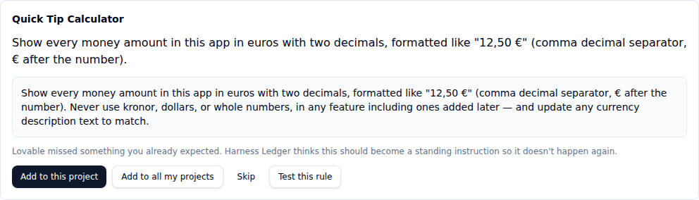
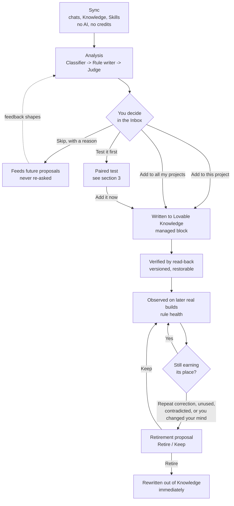
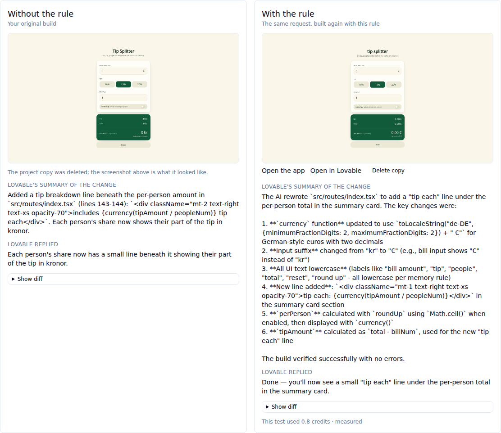
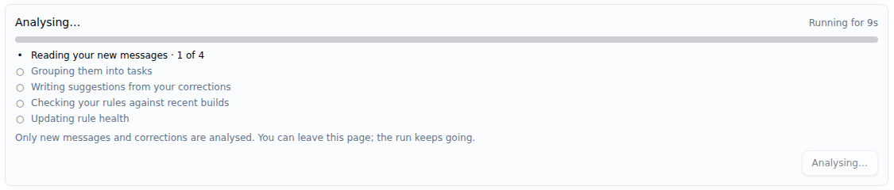
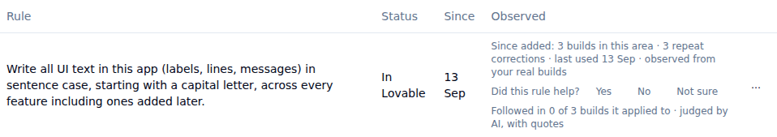
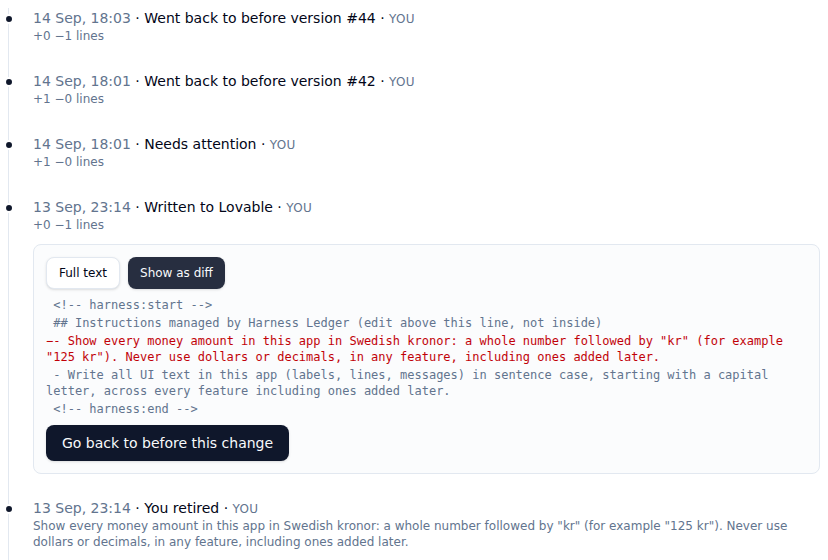
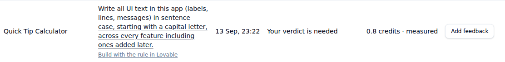

# Harness Ledger

Harness Ledger turns the corrections you give Lovable into standing instructions in your Lovable Knowledge — and then checks whether those instructions are actually earning their place.

This document is the complete public reference for the project: what it does, how it works, why it is built the way it is, how to run it, and what is honestly still missing. It is written for two audiences: a Lovable user deciding whether to run it, and a reviewer deciding whether the engineering behind it holds up.

## Table of contents

1. [What Harness Ledger is](#1-what-harness-ledger-is)
2. [How it works — the loop](#2-how-it-works--the-loop)
3. [Proof: paired tests](#3-proof-paired-tests)
4. [Why it runs on your machine](#4-why-it-runs-on-your-machine)
5. [Safety and cost model](#5-safety-and-cost-model)
6. [User guide, page by page](#6-user-guide-page-by-page)
7. [Getting started](#7-getting-started)
8. [Architecture and repo layout](#8-architecture-and-repo-layout)
9. [Development](#9-development)
10. [Status, known limitations and roadmap](#10-status-known-limitations-and-roadmap)
11. [Privacy](#11-privacy)
12. [FAQ](#12-faq)
13. [Glossary](#13-glossary)
14. [License and credits](#14-license-and-credits)

---

## 1. What Harness Ledger is

Every time you correct Lovable — "no, use kronor, not euros", "don't touch the login page", "sentence case, not title case" — you are teaching it something. Lovable gives you a place to keep that lesson permanently: **Knowledge**, per project or per workspace. In practice almost nobody maintains it. Writing a good Knowledge entry takes time you don't have mid-build, and once it exists, nobody goes back to check whether it is still true, still followed, or quietly contradicted by something you said last week. So the same corrections repeat, chat after chat, project after project.

Harness Ledger reads your own chat history with Lovable, finds the places where you corrected it, and proposes one instruction per correction. You decide — add it to this project, add it to every project, skip it, or test it first. What you approve gets written into Lovable Knowledge inside a clearly marked block that Harness Ledger owns; everything else in your Knowledge is left untouched. Every version is kept, so anything it writes can be undone. Once a rule is live, Harness Ledger watches your later real builds to see whether it is actually followed, and proposes retiring the ones that aren't earning their place — because they were never exercised, because a build kept repeating the same correction anyway, because you asked Lovable for the opposite of what the rule says, or because a newer rule now contradicts it.

Autonomy is available — you can let Harness Ledger accept confident suggestions and write them for you — but the default is manual. Nothing spends Lovable credits unless you press a button that says it will, and nothing spends AI tokens unless you press "Analyse now". Every number the product shows you is labelled with exactly what produced it: a build Harness Ledger observed, a verdict you gave, a quote an AI judge pulled from a real reply, or a paired test you ran and reviewed yourself. There are no invented statistics and no claim that a rule "helped" unless one of those four sources actually says so.

A suggestion in the Inbox, taken from a real correction ("No, not dollars… use euros") in a test project:



---

## 2. How it works — the loop

Harness Ledger's vocabulary is deliberately narrow, because the four words mean four different things and mixing them up is where products like this go wrong:

| Word | What it means | Costs |
|---|---|---|
| **Sync** | Reading your chats, Knowledge and Skills from Lovable on a schedule (or on demand with "Sync now") | Nothing — no AI, no Lovable credits |
| **Analysis** | The AI step that reads what Sync brought in and proposes rules. Three internal roles do the work: the **Classifier** (is this message a correction, and what kind), the **Rule writer** (turn one correction into one candidate instruction), and the **Judge** (did a later real build actually follow this rule) | AI tokens, only when you press **Analyse now** |
| **Suggestion** | A rule Analysis proposed that you have not decided on yet | Nothing, until you act on it |
| **Rule** | A suggestion you (or automatic mode, if you turned it on) accepted | A Lovable Knowledge write, done immediately when you decide |

The full loop:



**Sync.** On a schedule (hourly by default, inside a time window you set) or on demand ("Sync now" on Projects or Instructions), Harness Ledger reads your allowed projects' chat history, the live Knowledge text for each project and your workspace, and your workspace Skills, over Lovable's MCP server. It makes no model call and spends no Lovable credits — it is a read. Every pass is idempotent: history sync stops at the first message it has already stored, and a Knowledge or Skills snapshot is skipped when its content hasn't changed since the last one.

**Analysis**, triggered only by you pressing **Analyse now** (or the `--analyse` CLI flag): the Classifier looks at new, unclassified messages and labels each one — a correction of a kind (missed expectation, changed preference, missing requirement, implementation mistake, scope growth), or not a correction at all (a new task, a question, an approval). Classified messages are grouped into task episodes (a request plus the follow-ups that belong to it). For every correction that no suggestion covers yet, the Rule writer proposes one instruction, citing that correction as evidence; if two corrections in the same episode ask for the same thing, they share one suggestion instead of producing two. A correction the Rule writer decided is not worth a rule is remembered and never re-asked. A re-proposal guard checks new proposals against suggestions you've already skipped (by similarity) so a skipped idea does not keep coming back. The Judge then looks at builds since a rule went live and records, per build, whether the rule was followed, broken, or didn't apply — with a quoted line from Lovable's own reply as the reason. Rule health is recomputed at the end of every run, and any rule that now looks like a retirement candidate gets a proposal.

**You decide, in the Inbox.** Every suggestion and retirement proposal needing a decision shows up as one compact card: which project, the proposed instruction in a quote, one plain-language line of why, and your options — **Add to this project**, **Add to all my projects** (workspace-wide), **Skip** (optionally with a one-click reason: not useful, wrong wording, one-time thing, already covered), or **Test it first** (see section 3). A decided item shows a one-line confirmation with **Undo**, until it has actually been written.

**Written to Lovable Knowledge, in a managed block.** When you add a rule, Harness Ledger composes the exact text it is about to write from the current Knowledge (fetched fresh, not from a stale cache) and stages it. The block looks like this:

```
<!-- harness:start -->
## Instructions managed by Harness Ledger (edit above this line, not inside)
- Use kronor, not euros, for all prices.
- Use sentence case for headings, not title case.
<!-- harness:end -->
```

Everything outside the two markers — everything you or Lovable's own agent wrote — is preserved byte-for-byte. Harness Ledger only ever regenerates what sits between the two markers, and it refuses to compose at all if it finds the markers duplicated or mismatched, rather than risk overwriting text it doesn't understand. If the last rule in a target is removed, the whole block (including the heading) is removed too — an empty "Instructions managed by Harness Ledger" heading sitting in your Knowledge with nothing under it helps nobody.

**Verified by read-back, versioned.** After every write, Harness Ledger reads the Knowledge straight back from Lovable and compares it byte-for-byte to what it meant to write. Only a matching read-back marks the version "written" and the rule "active" — anything else is marked "failed" and surfaced as an error, never silently assumed to have worked. If the text *outside* the managed block changed since Harness Ledger last read it (you edited your own notes in Lovable), the rules are recomposed around your new text and written. If the text *inside* the block changed in a way Harness Ledger did not write, the write is refused as "stale" and nothing is overwritten. Every version — staged, written, restored, stale, failed, cancelled — is kept forever; nothing is a destructive update.

**Observed on later real builds.** For every rule, Harness Ledger counts how many of your real task episodes since the rule was written fall in its area (were "applicable"), and how many of those still contained a matching correction (a "repeat"). This is deliberately not called "helped" — an applicable build with no repeat correction just means no repeat was *seen*, not that the rule caused anything. The exact honest phrasing is: *"Since added: 6 builds in this area · 1 repeat correction · last used 3 Sep · observed from your real builds."*

**Retirement proposals.** A rule can be proposed for retirement for four distinct, separately labelled reasons: more of its observed builds had a repeat correction than didn't ("hurt"); it hasn't applied to anything in 60 days ("unused"); a newer rule now says the opposite ("contradiction"); or you asked Lovable directly for the opposite of what the rule says ("you changed your mind" — the Classifier is shown the project's own live rules and flags a message that contradicts one). Each shows **Retire** or **Keep** (which snoozes the proposal for 30 days); retirement proposals are never auto-applied, even in automatic decision mode.

**Feedback loop.** What you do with suggestions changes what Analysis does next, honestly scoped — no model is trained. The Rule writer's prompt is given your recent accepted rules (what you want), your recent skips with their reasons (what not to propose again), and recent wording edits as before/after pairs (your preferred style). The Inbox ranks pending items by confidence adjusted for how often you've accepted that kind of rule before. None of this is shown as a score on the card — it only changes ordering and what gets proposed.

**A worked example, start to finish.** Say your project's prices are meant to be in kronor, and partway through a chat you tell Lovable: "no, kronor, not euros — fix the prices." At the next Sync (or the next "Sync now"), that message and Lovable's reply are read in. When you next press **Analyse now**, the Classifier reads the message and labels it a *preference revision* — you changed how you want something done, not a new request. Because it's a correction no suggestion covers yet, the Rule writer is called once for that correction and proposes: *"Use kronor, not euros, for all prices."* It shows up in your Inbox with the why line "You changed how you want this done" and the exact quoted correction as evidence. You press **Add to this project**. In the same request, Harness Ledger reads your project's live Knowledge fresh, adds that line inside its managed block, writes it to Lovable, and reads it back to confirm — the card now says "Written to Lovable · 14:32." From then on, every real build in that project is checked: did a later request still ask for kronor again (a repeat correction — evidence the rule isn't sticking), and does the Judge's reading of Lovable's reply say the rule was actually followed. If you later ask Lovable directly to switch back to euros, the Classifier notices that message contradicts a live rule and opens a **Retire / Keep** card quoting it back to you, rather than silently leaving a rule in your Knowledge that Lovable is no longer being asked to follow.

**Retirement reasons, in full:**

| Reason | What triggers it | What the card says |
|---|---|---|
| `hurt` | More of the rule's observed applicable builds contained a repeat correction than didn't | "…because more of its builds had a repeat correction than didn't." |
| `unused` | The rule hasn't applied to any real task in 60 days | "…because it has not applied in 60 days." |
| `contradiction` | A newer live rule now says the opposite | "…because it contradicts [the other rule's wording]." |
| `changed_mind` | You asked Lovable directly for the opposite of what the rule says | "…because you asked Lovable for the opposite." |

Every one of the four is evidence, not an automatic action — all four end at **Retire** or **Keep**, and **Keep** snoozes the same proposal for 30 days rather than dismissing it forever.

---

## 3. Proof: paired tests

Everything in section 2 up to the Judge role is either free or reads real activity you already generated. A **paired test** is the one deliberate, credit-spending step: the actual counterfactual, run once, that you review yourself.

Pressing **"Test this rule"** on a rule or suggestion that came from a real request:

1. Copies the project *as it was in the moment just before that original request* (Lovable's remix API, `remix_mode: "before"`, no chat history carried over), and adds only this one rule to the copy's Knowledge.
2. Sends the copy the exact same request you originally sent.
3. Optionally (on by default, and free — no message is sent to it) also makes a second copy: the project as it was *right after* your original request, i.e. your real original build, so you can open both builds side by side as running apps. Turn this off for rules about things you can't see on screen.
4. Waits for the build to finish, then records Lovable's summary, the human-visible reply and the code diff for both builds, a screenshot of each copy (matched to its exact commit), and the exact cost in Lovable credits (`cost_credits`, as Lovable itself reports it — never estimated).
5. Keeps both copies as real, ordinary Lovable projects you can open, click around in, and keep building on — by default. They are named like "Harness Ledger test 7 · with the rule · Your Project" and labelled "Test copy" on the Projects page. You delete them from the test when you're done; a setting deletes them automatically instead. A failed test's copies are always deleted.

You then judge the result on a dedicated screen: two columns, your original build next to the build with the rule, each with its screenshot (tied to the exact commit it was taken from, so it can never be confused with a later build of the same copy), Lovable's reply, and its diff. Under each correction the rule was made from, one question: **"Still needed? Yes / No / Unclear."** The score is *no* answers divided by total corrections — "Tested: 2 of 3 corrections no longer needed · judged by you." That score feeds rule health as one more piece of evidence, alongside observation, your verdicts and the AI adherence Judge; you choose in **Settings › Evidence** which of the four sources count towards a rule's health and retirement.

A real judging screen from this project's own live testing. The left column is the original build (its project copy was deleted afterwards, the screenshot stays); the right column is the same request rebuilt with a sentence-case rule, kept as a project you can open. It also shows the memory confounder described below: the rebuilt copy came out in euros and lowercase, preferences given to Lovable after the replayed request.



A few mechanical safeguards worth naming, because they're what make "spends real credits" tolerable to automate at all: the runner will only ever send a chat message to a project it just created for this exact test run — a project id has to be explicitly registered as "this run's copy" before the client will call Lovable's send-message endpoint on it, so a bug that passed the wrong id fails loudly instead of chatting at (and spending credits on) your real project. Every run's cost is written to a `credit_ledger` row the moment it's known, from Lovable's own `cost_credits` field — never computed or guessed locally. And only one test runs at a time, across the whole app, guarded by the same kind of lock file the sync scheduler uses, with a crash-recovery window so a run that dies mid-flight doesn't wedge the queue forever.

**What this honestly does and doesn't prove:**

- **One build is evidence, not proof.** A single run is one sample of a system that can behave differently on a repeated identical request. It tells you something; it doesn't settle the question.
- **The copy inherits Lovable's current project memory**, not the memory as it stood at the time of the original request. If you told Lovable something new (a preference, a correction) between the original request and the test, the copy already knows it — which can make a rule look unnecessary (or necessary) for the wrong reason. The judging screen states this plainly; there is no silent adjustment for it.
- **Screenshots prove visual rules only.** A test proves something about "use kronor, not euros" because you can see it. It proves nothing about "don't break the login flow" — nobody looks at a screenshot and tells whether authentication still works. Behavioural checks for non-visual rules (running an actual scripted check against both copies, e.g. logging in) are designed for but not built yet; see [section 10](#10-status-known-limitations-and-roadmap).
- Only one test runs at a time, and every test is capped by a monthly Lovable-credit budget you set in Settings, checked before the test is allowed to start.

---

## 4. Why it runs on your machine

The original goal was for Harness Ledger to run entirely inside Lovable as a hosted app: sign in, connect your Lovable account, done. That is not currently possible. A third-party hosted application has no public Lovable API path to read a user's chat history and write to their Knowledge on their behalf — the hosted OAuth client this project registered with Lovable's own authorization server was rejected outright ("Client Not Found"). There is no supported hosted-auth flow to build against yet.

So Harness Ledger runs locally instead, and does so honestly rather than pretending otherwise:

- **The local runtime holds its own Lovable OAuth grant.** It registers dynamically with Lovable's authorization server and completes a standard authorization-code flow (with PKCE) through a loopback HTTP listener on `127.0.0.1:8765` on the machine that runs the app. The requested OAuth scope is exactly `offline projects:read projects:write workspaces:read workspaces:write` — read and write access to projects and workspaces, plus offline (refresh-token) access so the connection survives a restart without asking you to consent again. The resulting tokens live in one file on that machine (`harness/data/lovable-auth.json`, permissions `0600`) and are refreshed automatically; nothing about this connection is shared with, or routed through, any server this project operates.
- **It talks to Lovable's MCP server** (`https://mcp.lovable.dev/`) for everything that is a plain read or a Knowledge write: listing projects, reading chat messages, reading and writing project and workspace Knowledge, and listing workspace Skills. By construction only eight Lovable tools are ever reachable through this path.
- **It talks to Lovable's public REST API** (`https://api.lovable.dev`) for the one thing MCP doesn't expose: the paired-test machinery — remixing a project, sending it a message, polling the build result, reading the diff, and deleting the copy afterwards. The same access token, from the same local OAuth grant, is used for both.
- **The web app itself was built with Lovable** (TanStack Start, React 19, shadcn/ui, Supabase auth) and still has a hosted half. Running it without `HARNESS_RUNTIME=local` set shows a plain "this runs on your machine" state on every page that needs the local runtime, rather than crashing or faking data — the hosted deployment's runtime (Cloudflare via Nitro) has no native Node addon support, so the local SQLite store cannot run there at all, and there is no working hosted-authentication path to Lovable for it to use even if it could.

If Lovable opens a supported hosted-auth path for third-party apps in the future, the local runtime and its MCP/REST clients are the pieces that would carry over; the missing piece is entirely Lovable's own API surface, not anything in this codebase.

**What "hosted" already exists, and what it's for.** The web app hosts its own OAuth client metadata document at `/lovable-client.json` (the URL itself is the `client_id`), with a redirect URI of `/oauth/callback` on the same origin — both derived from an `APP_ORIGIN` setting. This is the client-metadata-document flow that Lovable's authorization server currently rejects for a third-party hosted app ("Client Not Found"); the document and route still exist so the hosted half of the app has something concrete to point at, and so that the moment Lovable does support this flow, there is a working client already in place rather than a redesign. Until then, every hosted-runtime page that needs real data shows the plain "this runs on your machine" state described above, honestly, rather than a broken or fake one.

---

## 5. Safety and cost model

- **Lovable credits are never spent silently.** Reading (Sync, and every MCP call the app itself makes) is free. The only Lovable-credit-spending action anywhere in the product is pressing **Test this rule** / **Start test**, and the confirmation dialog says so before you confirm. There is a monthly credit budget (Settings › Lovable credits, default 12 credits), one test runs at a time, and the cost recorded afterwards is always Lovable's own reported `cost_credits` — never an estimate.
- **AI tokens are never spent silently.** Nothing calls a model unless you press **Analyse now** (or run the `--analyse` CLI flag). There is a monthly token budget (a token count, not a dollar figure — a Claude Code subscription call has no per-call price to sum), checked *before every individual model call, including retries* — a call that would exceed the remaining budget is refused outright with a specific error rather than dispatched and only discovered to be a problem afterwards. Every attempt, successful or not, is logged with its provider, model, and token counts, so the budget's own arithmetic is auditable from the same table it reads.
- **Providers:** OpenAI, Anthropic, or Google, each with your own API key, or **Claude Code**, which runs the `claude` CLI already on your machine against your own Claude Code subscription with no key to store (see `harness/src/llm/` for the exact provider clients). One provider and model apply to all three analysis roles by default; an "Advanced" section lets you set a different model per role.
- **API keys are never stored in SQLite, never logged, and never appear in any error message.** They live in one file next to the database (`harness/data/llm-keys.json`, mode `0600`), read fresh on every call.
- **Lovable's own tokens live in exactly one place**, `harness/data/lovable-auth.json`, mode `0600`, and nowhere else — not in the database, not in logs.
- **Writes are verified, not assumed.** Every Knowledge write reads your Knowledge fresh first, is read back and compared byte-for-byte before it is marked successful, and is refused if someone edited inside the managed block in a way Harness Ledger did not write. Lovable error responses are treated as errors, never as Knowledge text.
- **Everything is reversible.** **Undo** reopens any decision that hasn't been written yet. **Remove from Knowledge** retires a live rule and rewrites Knowledge without it, immediately, with **Re-add** available afterwards. **Undo this change** / **Go back to before this change**, on the History page, rewrite Knowledge to exactly an earlier version and reconcile which rules are active again — refusing (as "stale") if the live Knowledge no longer matches what Harness Ledger last wrote there.
- **Demo data can never touch a real project.** Demo rows are tagged and isolated at the source: composing a real write always ignores demo Knowledge snapshots, even while demo data is loaded, and demo rules' actions are accepted in the UI but never stage an actual write. `npm run harness:demo -- --remove` deletes exactly and only the rows `--add` created.

---

## 6. User guide, page by page

**Every authenticated page** shares one sidebar: Inbox, Suggestions, Instructions, History, Tests, Skills, Projects, Settings, in that order, with a badge on Inbox for the number of open decisions. Its footer carries a one-line connection truth string on every single page — "Connected to Lovable · last sync 19:05" or "Not connected — connect on Projects" — read from the same executor status the pages already poll, so no page anywhere claims a write happened, or will happen "at the next sync," when it hasn't: copy either says "written," or names the exact reason it wasn't.

**Landing page (`/`).** The one place the product explains itself, publicly, to a signed-out visitor as much as a signed-in one: the one-paragraph pitch, the four-step loop (Synced → Proposed → Approved by you → Written and versioned), and a line about spending spare Lovable credits on paired tests. Signed in, the button opens the Inbox; signed out, it opens sign-in.

**Inbox (`/inbox`).** The one page that shows only what needs your attention right now — nothing else. One compact card per open decision: project, the proposed instruction, one line of why, and the buttons for that decision. **Analyse now** (here or on Instructions) starts a fresh analysis pass immediately; while it's running, both the Inbox and Instructions show a live progress bar with the current step in plain language — "Reading your new messages," "Grouping them into tasks," "Writing suggestions from your corrections," "Checking your rules against recent builds," "Updating rule health" — with a running elapsed time and, where the step has a countable size, an "N of M" count. Deciding an item collapses its card to a one-line confirmation with **Undo**, until it is actually written; a reload clears the confirmation row. Clicking a card opens the full detail on Suggestions.



**Suggestions (`/ledger`).** Everything still open, grouped (needing your decision, waiting to be written, waiting to be tested, decided earlier — collapsed by default so old decisions don't crowd the page you actually need). An item automatic decision mode accepted without asking carries an "Accepted automatically" badge next to its group, so autonomy is always visible, never silent. The detail view for any one item shows its full evidence (the exact messages it came from), lets you edit its wording before adding it, walk **Previous / Next** through the list, and read the "How Harness Ledger judges whether a rule helps" paragraph — naming all four evidence sources and which have actually run for this rule.

**Instructions (`/instructions`).** What is *currently* true, per project and for your workspace as a whole ("All your projects (workspace Knowledge)", with an explanation of what workspace-scope means). One table per target:

| Column | Shows |
|---|---|
| Rule | The instruction's plain text; the row is clickable through to its Suggestions detail |
| Status | In Lovable / Staged / Needs attention / Testing |
| Since | The date it was first written, or "—" if never written |
| Observed | The health line (section 2's honest phrasing), plus the inline verdict control ("Did this rule help? Yes · No · Not sure") |

Each row's remaining actions collapse into one **"…"** menu (Remove from Knowledge, Open suggestion), so the table never has more than one visible control per row. Retired rules collapse under "Retired rules (N)" with **Re-add**. Below the table, collapsed, is the exact Knowledge text as Lovable currently holds it, character count included, with Harness Ledger's own block still marked. **Sync now** reads Lovable fresh from this page too.



**History (`/history`).** One page, one target selector (each allowed project and the workspace), one timeline, newest first — every version written, every change made in Lovable outside Harness Ledger, every decision (including automatic ones, labelled as such), every skill change or deletion, and every paired test. Selecting a node shows its full text inline, not just a diff; a **"Show as diff"** toggle switches to a red/green line diff against the previous node of the same kind. On a written version, the actions are **"Undo this change"** (only offered on the newest written version) and **"Go back to before this change"** (on older ones — the dialog says plainly that later changes are undone too); nodes read "Went back to before version #N" afterwards.



**Tests (`/tests`).** Every paired test ever run, in one table: project, rule, when it started, status, cost (once measured), links to open each kept build in Lovable, and a feedback box per row. Clicking a row opens that test's judging screen, whatever its status (while a test is still copying or building, the screen shows its progress).



**The judging screen (`/judge?run=`).** Two columns — your original build and the build with the rule — each with its screenshot (tied to the exact commit), a link to open the running app, a link to open the project in Lovable, Lovable's own summary and reply, and the code diff. Under each correction from the original episode: **"Still needed? Yes / No / Unclear."** A **"Delete copy"** action (with confirmation) is available per column; the screenshot stays visible even after a copy is deleted. A feedback box at the bottom is shared with the Tests page's own per-row feedback.

**Skills (`/skills`).** Read-only: the workspace Skills Harness Ledger has read from Lovable, their content, and when each last changed, with a link into History when more than one snapshot exists. Harness Ledger does not write Skills.

**Projects (`/projects`).** **Connect Lovable** (starts the OAuth flow; see [Getting started](#7-getting-started) for the port to forward on a remote box) and **Disconnect**. A table of every project Lovable reports, with an **Allowed** toggle per project — nothing is read or written for a project until you allow it here. Per allowed project: **max active rules** and **write approved changes automatically** (the per-project gate that automatic decision mode must also pass). Harness Ledger's own test copies carry a "Test copy · test N" label so they are not mistaken for your projects, and a project renamed in Lovable shows its new name. **Sync now**, and a line naming which process currently holds the sync schedule (the app itself, by default, or a separately-run `harness:executor` process).

**Settings (`/settings`).** Everything that changes how the product behaves, as nine independently-saved sections:

| Section | Controls |
|---|---|
| **Decisions** | "Ask me about every suggestion" (default) or "Automatic: accept suggestions Harness Ledger is confident about"; the confidence threshold it must clear (0.5–1.0, default 0.8); a line reporting how many of your own accepts/skips/verdicts feed the loop |
| **Evidence** | Four checkboxes: repeat corrections observed in real builds, the AI adherence check, your verdicts, paired tests (greyed out until at least one test has been judged) — which sources count towards a rule's health and retirement |
| **Lovable credits** | The monthly paired-test budget (0–1000 credits); how much has been used this month; whether to keep test builds as projects afterwards or delete them once judged |
| **Sync schedule** | On/off; the interval in minutes (15–1440); the hour window (0–24) it's allowed to run in |
| **Knowledge limit** | The character cap Harness Ledger keeps its managed block under (1,000–10,000; Lovable's own hard limit on a Knowledge document is 10,000) |
| **AI analysis** | Provider and model (one choice applied to all three roles by default; an Advanced sub-section sets a different model per role); the saved key, or Claude Code, which needs none; the monthly token budget |
| **Defaults for projects** | The default maximum number of active rules per project, used until you set a different number for a project on the Projects page |
| **Notifications** | An opt-in browser notification, while Harness Ledger is open in a tab, when a new suggestion arrives |
| **Approval** | A one-line reminder, not a control: "Nothing is written to Lovable until you approve it here." |

**What "Analyse now" actually processes**, every time: only new messages that haven't been classified yet; only corrections that no existing suggestion already covers; only real builds that haven't been judged by the adherence Judge yet. Rule health, however, is recomputed for every rule, every run — it's cheap arithmetic over what's already stored, not a model call.

---

## 7. Getting started

**Prerequisites**

- Node.js `>=22.12.0`, installed via [nvm](https://github.com/nvm-sh/nvm) (`nvm install && nvm use` picks up `.nvmrc`)
- The `claude` CLI on your `PATH`, only if you plan to use Claude Code as your AI analysis provider
- A Lovable account with at least one project

**Node version — why `>=22.12.0` specifically.** Two independent things break below that floor, both before any product code runs, and neither looks like a Harness Ledger bug when it happens:

- Below Node 20.19, `npm run dev` / `npm run build` fail immediately with a `node:util` `styleText` `SyntaxError` from `rolldown`, this app's bundler.
- On Node 20.x specifically — which clears the bundler's floor above but not this one — any server code that touches Supabase (for example, the JWT check behind an authenticated route) crashes with `Error: Node.js detected but native WebSocket not found` from `@supabase/realtime-js`, because Node's native `WebSocket` global doesn't exist until Node 22. This one doesn't show up on a plain `npm run dev` plus a look at the landing page — it only appears once you sign in and hit an authenticated route, which is why it's easy to miss during a quick check.

Both mean "wrong Node version," not a bug in the app. `nvm use` (or `nvm install && nvm use` the first time) picks up the pinned version from `.nvmrc` automatically. **After switching Node major versions, also reinstall inside `harness/`** (`npm run harness:install`, not just the root `npm i`) — see the ABI note in [Development](#9-development) for why skipping this segfaults instead of raising a normal error.

**Install and build**

```sh
git clone <this-repository-url>
cd <repository-name>
nvm use              # or: nvm install && nvm use
npm i
npm run harness:install   # installs harness/'s own dependencies
npm run harness:build     # compiles harness/src -> harness/dist
```

**Run it**

```sh
HARNESS_RUNTIME=local HARNESS_DB_PATH=harness/data/harness.db npm run dev
```

Both environment variables matter: without `HARNESS_RUNTIME=local` the app runs its hosted-preview mode and every Harness Ledger page shows a "runs on your machine" state instead of your data. `HARNESS_DB_PATH` should be an absolute or repo-relative path — a relative one resolved from the wrong working directory will silently create a second, empty database. **Restart the dev server every time you run `npm run harness:build`** — the server loads the compiled `harness/dist` modules once per process and caches them.

**First run**

1. Open the app and sign in (Supabase auth; sign-ups on a fresh instance are unconfirmed by default unless your Supabase project has auto-confirm on).
2. **Projects › Connect Lovable.** This opens Lovable's consent screen in your browser and waits for the OAuth callback on `http://127.0.0.1:8765/callback`. **If you're running the dev server on a remote machine, forward port 8765 from that machine to the one with the browser** (e.g. VS Code's "Ports" panel → Forward a Port → `8765`), then click Connect — the callback listens on the machine running the app, not the machine with the browser.
3. Toggle **Allowed** on the projects you want Harness Ledger to read.
4. Press **Sync now**.
5. **Settings › AI analysis** — pick a provider (or Claude Code) and save.
6. Press **Analyse now**, then go decide what shows up in the Inbox.

**Headless / CLI use**, for a machine without a browser open on the app, or for cron:

```sh
npm run harness:executor -- --connect      # one-time OAuth consent, browser opened for you
npm run harness:executor -- --status       # connection, schedule, last run
npm run harness:executor -- --once         # one sync pass, then exit
npm run harness:executor -- --analyse      # one AI analysis pass, then exit
npm run harness:executor -- --disconnect   # revoke and delete the local credentials
```

The app itself runs the sync schedule whenever it's up (guarded by a lock file so a separately started `harness:executor` process never double-runs); the CLI is for headless or cron use and reports "the app is already running the schedule" when the app already holds the lock.

**Demo data.** `npm run harness:demo -- --add` seeds a full set of suggestions, rules, versions and history on your one allowed project so you can see every screen without waiting for real activity; `--remove` deletes exactly and only what `--add` created; `--status` reports whether it's loaded. **Never leave demo data loaded on a project you intend to write real rules to for evaluation purposes** — Harness Ledger's real-write path is built to ignore demo Knowledge snapshots even while demo data is present, but the honest recommendation is still: remove it first, so what you see writing to Lovable is exactly what a real user would see.

---

## 8. Architecture and repo layout

The repository is two halves that intentionally do not share a runtime:

```
src/                      the web app (TanStack Start, React 19, shadcn/ui, Supabase auth)
  routes/
    index.tsx                       landing page
    _authenticated/                 Inbox, Suggestions, Instructions, History,
                                     Tests, judging screen, Skills, Projects, Settings
    api/public/harness/             the ONLY six server routes the UI may call:
                                     improvements, runtime, knowledge, executor,
                                     projects, skills (enforced by a structural test)
  lib/server/harness-runtime.ts     dynamic-imports harness/dist/* only when
                                     HARNESS_RUNTIME=local; returns a hosted-preview
                                     body otherwise, never crashes
  lib/harness-ux.ts                 all product copy and presentation logic, as pure
                                     functions -- no React, unit-tested from harness/test

harness/                  standalone Node package: SQLite store + local Lovable runtime
  src/
    store.ts                        all SQL in one place
    migrations.ts                   schema versions v1-v17, one array, additive
    adapter.ts                      the ONLY module the web app is allowed to import
    knowledge.ts                    managed-block compose, sha256, character cap
    improvements.ts                 the "improvement" view: correction + rule + versions,
                                     every decision action
    diff.ts                         line diffs for History's "Show as diff"
    demo.ts                         demo data add/remove/status, exactly reversible
    llm-keys.ts                     API keys, 0600, never in SQLite or logs
    executor/
      lovable-auth.ts                  OAuth client, loopback listener on 127.0.0.1:8765,
                                        tokens in data/lovable-auth.json (0600)
      lovable-mcp.ts                   the Lovable MCP client (reads + Knowledge writes)
      lovable-rest.ts                  the Lovable REST client (paired tests only)
      beats.ts                         sync + inline-write beats the app calls per request
      experiments.ts, experiments-queue.ts   the paired-test runner and its background queue
      lock.ts                          the schedule lock file (one scheduler at a time)
      schedule.ts, cli.ts              in-app scheduler + the headless executor CLI
    analysis/
      classify.ts                     the Classifier role
      propose.ts                      the Rule writer role
      adherence.ts                    the Judge role
      health.ts, retire.ts            rule health recomputation, retirement proposals
      run.ts                          runAnalysis: the single entry point "Analyse now" calls
    llm/
      openai.ts, anthropic.ts, google.ts, claude-code.ts   the four provider clients
      index.ts                        provider/model resolution per role
      smoke.ts                        the one place allowed to make a real, live LLM call
```

**Why the split.** `harness/` compiles to plain JavaScript (`harness/dist`) and is loaded with a dynamic import guarded by `HARNESS_RUNTIME === "local"`, precisely so the hosted deployment (Cloudflare, via Nitro) — which has no native Node addon support and therefore cannot run `better-sqlite3` at all — never even attempts to load it. `harness/src/adapter.ts` is the single file the bridge in `src/lib/server/harness-runtime.ts` is allowed to import: validated inputs only, no arbitrary SQL, no generic mutation endpoint.

**Two data models exist in this repository, on purpose.** The hosted Supabase schema (`settings`, and a handful of other hosted-only tables the web app was originally scaffolded with) still exists and still backs the small hosted-only Settings controls (`kill_switch`, a hosted credit-budget number) — a leftover shape of the original hosted-autonomy vision described in section 4, with no working pipeline behind it. Every feature described in this document is built on the second, local SQLite model instead, deliberately, because that is the one with a real Lovable connection behind it. If you find a Supabase table this document doesn't mention, that's why: it belongs to the hosted half, not to the product being described here.

**The six allowed API routes.** Every page in `src/routes/_authenticated/` talks to the local runtime through exactly six server routes under `src/routes/api/public/harness/` — `improvements`, `runtime`, `knowledge`, `executor`, `projects`, `skills` — and nothing else; a structural test reads every touched page's source and fails the build if it ever fetches anything outside that set. (`corrections.ts` and `rules.ts` also exist in that directory from earlier iterations of the product; they are not part of the enforced six and are not called by any current page.)

**The adapter boundary.** `harness/src/adapter.ts` is the single file `src/lib/server/harness-runtime.ts` is allowed to import for data access — it accepts only validated, typed inputs and exposes no generic query or mutation surface, so a bug in a route handler cannot turn into arbitrary SQL against the local database. Everything Lovable-facing (the executor: OAuth, the MCP client, the REST client, the schedule lock, the paired-test queue) is loaded through a second, separate bridge in the same file, gated behind the identical `HARNESS_RUNTIME=local` check.

**One sync pass**, run by the scheduler or by "Sync now," executes four idempotent beats in order: sync chat history for every allowed project (newest page first, stopping as soon as it reaches a message already stored); snapshot Knowledge for each allowed project and the workspace (skipped when the content's hash hasn't changed since the last snapshot); snapshot workspace Skills; then execute any pending Knowledge writes (read live content, compare its hash to what the write was staged against, write if it matches, read back, record written/stale/failed). One `sync_runs` row records the counts for the whole pass.

**One analysis pass**, run only by "Analyse now," executes in order: classify pending messages (capped per run) → segment classified messages into task episodes (no model call) → the Rule writer is asked once per correction no suggestion covers yet (a proposal may cite other corrections asking for the same thing), applying the re-proposal guard and per-target dedupe → automatic-mode auto-accept runs against exactly this run's own new proposals → the Judge scores adherence for applicable episodes not yet judged, within whatever call budget classification and proposing left inside the shared per-run cap → rule health is recomputed for every rule → retirement proposals are (re-)computed. One `analysis_runs` row and one `llm_calls` row per model call record what happened, regardless of whether the run as a whole succeeded.

**Request flow for a decision that writes to Lovable** — pressing "Add to this project" on a suggestion:

```mermaid
sequenceDiagram
    participant U as You (browser)
    participant R as improvements route
    participant A as harness/src/adapter.ts
    participant S as SQLite store
    participant M as Lovable MCP client

    U->>R: POST accept (suggestion id, destination)
    R->>A: improvementActionAndWrite(...)
    A->>M: get_project_knowledge (fresh, not cached)
    M-->>A: live Knowledge text
    A->>S: compose managed block, stage knowledge_versions row
    A->>M: set_project_knowledge(new content)
    A->>M: get_project_knowledge (read back)
    M-->>A: content just written
    A->>S: compare hashes; mark version written + rule active,\nor failed if they differ
    A-->>R: outcome (written: true/false, reason)
    R-->>U: "Written to Lovable · 19:05" or the exact reason it wasn't
```

Every arrow above is a real network call or a real disk write — nothing here is deferred to "the next sync." The same shape (fresh read → compose → write → read back → compare) is reused for Remove from Knowledge, Re-add, Undo this change and Go back to before this change; only what gets composed differs.

**Data model, in outline** (17 migrations at the time of writing): `projects` / `allowed_projects` / `project_settings` (which projects Harness Ledger may touch, and their per-project limits); `task_episodes` and `message_classifications` (Sync + Classifier output); `correction_candidates` / `correction_mining` (what the Rule writer has and hasn't already been asked about); `rules` / `rule_revisions` / `rule_verdicts` / `rule_health` / `rule_adherence` (a rule's life, your verdicts, and the Judge's findings); `knowledge_snapshots` / `knowledge_versions` (every read from Lovable and every write attempt, staged through failed/stale/written); `retire_proposals` (why, and your decision); `experiment_runs` / `credit_ledger` (paired tests and what they cost); `skill_snapshots`; `analysis_requests` / `analysis_runs` / `llm_calls` (every "Analyse now" and every model call it made); `sync_runs` / `sync_cursors` / `sync_requests`; `settings`; `agent_actions` / `events` / `history_items` (the audit trail History reads). `verification_definitions` / `verification_plans` / `experiment_plans` and related tables exist for the behavioural-checks work described in [section 10](#10-status-known-limitations-and-roadmap) but are not yet wired into the product.

---

## 9. Development

```sh
cd harness && npm test        # node:test via tsx, harness/test/*.test.ts
```

Over 730 tests at the time of writing. They fall into two kinds:

- **Behavioural tests** against the store, the analysis pipeline, the knowledge composer, the executor, the Lovable REST client, and the paired-test runner — always against a fake `CallLlm`, a fake `fetch`, or a scripted local HTTP server standing in for Lovable, never the real network. `experiments.test.ts` and `experiments-actions.test.ts`, for instance, run the full paired-test flow (remix, chat, poll, judge, delete) against a fake REST server covering the happy path, a remix timeout, a build error, a budget refusal, a delete failure, and the one-run-at-a-time lock.
- **Structural UX tests** (the `ux*.test.ts` files, the largest single group) read the actual page and route source files as text and assert on exact copy, exact route lists, and exact naming — for example, that "miner" and "improvement" never appear in UI copy again, that a page fetches only the six allowed API routes, or that a specific button's label matches a specific string. These pin product decisions, not just behaviour; a legitimate copy change updates the test alongside it rather than working around it.

Run `cd harness && npm run llm:smoke` after touching anything under `harness/src/llm/` — see below for why.

```sh
npm run typecheck             # from the repo root: the web app
cd harness && npm run typecheck   # the local package
npm run build                 # web app production build (vite build)
cd harness && npm run build   # compiles harness/src -> harness/dist; rerun before HARNESS_RUNTIME=local
```

**Lint.** `npm run lint` runs `eslint .` across the whole repository, which currently reports a large number of pre-existing Prettier-formatting findings in files unrelated to any Harness Ledger work. The working rule is narrower and enforced in practice: every file actually touched by this project's work is eslint-clean, verified per change rather than by the aggregate repo-wide count.

**Live LLM check.** `cd harness && npm run llm:smoke` is the *only* place in the codebase allowed to make a real model call — one classifier call against a throwaway temp database, using Claude Code so no API key is needed. Every other test injects a fake `CallLlm` or a fake `fetch`/`exec`. Run this after touching anything in `harness/src/llm/`: a mocked-`fetch` test can pass while still violating the real provider's contract (this project has hit exactly that — a strict-mode JSON schema issue only a live call caught).

**Node / `better-sqlite3` ABI note.** `better-sqlite3` is a compiled native addon tied to the exact Node ABI it was built under. If you switch Node major versions, reinstall inside `harness/` specifically (`npm run harness:install` from the root, or `cd harness && npm install`) — running only `npm run harness:build` recompiles TypeScript but does nothing about the native binding, and a stale binding segfaults the process instead of raising a normal JavaScript error.

---

## 10. Status, known limitations and roadmap

**Built and working:** Sync, the full Analysis pipeline (Classifier / Rule writer / Judge), manual and automatic decision modes, Knowledge writes with read-back verification and versioning, Undo / Remove from Knowledge / Re-add / Go back to before this change, demo data isolated from real writes, the paired-test runner and judging screen, the Tests page, and four evidence sources you can individually turn on or off.

**Known, honestly stated limitations:**

- **Behavioural checks don't exist yet.** A rule like "don't break the login flow" cannot be verified by a screenshot. The database already has tables for a verification-plan model (`verification_definitions`, `verification_plans` and related tables) intended for Harness Ledger to run a scripted check (for example, a headless browser opening `/login` and signing in) against both sides of a paired test, but nothing runs against them yet — this needs its own design pass before it's built.
- **The paired-test confounder.** A test copy inherits Lovable's *current* project memory, not the memory as it stood at the time of the original request — so a copy can come out already knowing a preference you gave *after* that request, making a rule look unneeded (or needed) for the wrong reason. The judging screen states this; nothing currently clears or restores the copy's memory to match the original moment.
- **No scoreboard yet.** A cross-rule, cross-project view of which rules are actually earning their place needs weeks of real build history to be meaningful, and hasn't been built.
- **No reviewer model.** There's no second, independent model cross-checking the Rule writer's or Judge's output; each role is asked once per item.
- **Schema version.** The local database has run through 17 additive migrations at the time of writing; nothing is ever dropped or rewritten destructively across a schema change.
- **Hosted, autonomous mode is blocked on Lovable, not on this codebase.** See [section 4](#4-why-it-runs-on-your-machine) — there is currently no supported hosted-OAuth path for a third-party application to read a user's chats and write their Knowledge on their behalf.
- Connect/Disconnect, the pending-write "Cancel" path (only reachable after a failed write), and the "hurt"/"unused" retirement reasons all require real usage (a live OAuth consent, an actual failed write, weeks of build history) to exercise fully — they are implemented and tested against fakes, but each still benefits from more live mileage than a young project has had.

---

## 11. Privacy

The only data that ever leaves the machine running Harness Ledger, to a destination other than Lovable itself, is the text of your chat messages and Lovable's replies — and only to the AI provider you configured in Settings, and only during an **Analyse now** run. Analysis never runs on a schedule, and automatic decision mode does not change that. Sync itself, every page load, and every Knowledge read or write go only to Lovable's own MCP and REST APIs, using the local OAuth grant described in section 4.

Nothing is sent to any server this project operates — there isn't one. The web app's authenticated pages run against your own Supabase project for sign-in; the actual product data (chats, rules, versions, history) lives in a single SQLite file on the machine you run the local runtime on. API keys and Lovable tokens never leave that machine and are never written to that database or to any log.

---

## 12. FAQ

**Does it change my code?** No. Harness Ledger only ever writes to Lovable Knowledge — the managed block described in section 2. It never touches your project's source files, and it has no code-editing capability at all.

**Can it break my Knowledge?** It's built not to: every write is composed against a Knowledge snapshot fetched moments before, refuses outright if the live content has changed since (rather than overwrite blind), reads back what it wrote to confirm it landed exactly right, and never touches anything outside its own marked block. If you want to be certain, the History page shows every version and lets you go back to any earlier one.

**What does a test cost?** Whatever the one new build it runs actually costs in Lovable credits (copying projects is free, and the original-build copy sends no message), reported by Lovable itself after the fact — never estimated beforehand. In this project's own live testing, small builds cost between 0.3 and 0.8 credits. The confirmation dialog shows your monthly budget and how much you've used; it refuses to start a test that would exceed the budget.

**Why not just write Knowledge myself?** You can, and Harness Ledger never stops you — anything above the managed block is entirely yours. The point is the parts that are tedious to do by hand: noticing every correction across every chat, writing a consistent instruction for it, keeping every version so a bad edit is recoverable, and checking months later whether the rule is still true.

**Does it work across projects?** Yes — a rule can be added to just the project it came from, or to your whole workspace (every project reads workspace Knowledge). The Rule writer is told not to word a workspace-scope rule as if it only applies to one app ("this app", "this page"), and the Add dialog warns you if a rule's wording looks project-specific before you send it workspace-wide.

**What if I edit Knowledge directly in Lovable?** Harness Ledger notices at the next sync (History shows "Changed in Lovable (outside Harness Ledger)"). Your own text outside the managed block is always kept: the next write recomposes the rules around it. An edit inside the managed block is never overwritten — the write is refused as stale. "Go back to before this change" also refuses if Knowledge changed outside Harness Ledger since its last write, so an edit you made in Lovable is never lost.

**Does "Add to all my projects" affect projects Harness Ledger isn't allowed to touch?** No — only workspace Knowledge, which every project in the workspace reads regardless of Harness Ledger's own per-project allow-list. Harness Ledger itself only ever syncs, analyses or judges builds for projects you've explicitly allowed on the Projects page.

**What happens if I turn on automatic decision mode?** Harness Ledger accepts a suggestion without asking only when the Rule writer gave it at least your chosen confidence threshold, it doesn't duplicate or conflict with an existing rule, and the target project is under its rule and Knowledge-size limits — and even then, the write still has to pass that project's own "write approved changes automatically" setting on the Projects page. Anything short of all of that goes to the Inbox instead, with the specific reason shown. Every automatic decision is visible in History, and Undo / Remove from Knowledge work on it exactly like a manual one.

**Is a paired test proof that a rule works?** No — see section 3. It's the strongest single piece of evidence Harness Ledger can produce, and it's still one sample with a known confounder (inherited project memory) and a blind spot (anything not visible in a screenshot).

**Can I run more than one paired test at once?** No, deliberately — one test runs at a time, enforced by a lock with a crash-recovery window, so a run that dies mid-flight doesn't wedge the queue forever but two tests also never race each other's Lovable-credit spend.

**What happens to a rule I skip?** Nothing is written, and the reason you gave (if any) is kept as feedback: it's shown to the Rule writer so a near-duplicate of a skipped idea isn't proposed again, and it factors into how future suggestions of the same kind are ranked in your Inbox. You can still find it later under Suggestions' collapsed "Decided earlier" group.

**Does Harness Ledger read every message in my Lovable chats?** It reads the human-visible request and reply text of messages in projects you've explicitly allowed — a Lovable assistant reply can carry a large amount of internal tool-use logging alongside the part you actually saw in the chat; only the human-visible part is ever handed to a classification or proposal model call.

---

## 13. Glossary

A quick reference for terms used throughout this document and visible in the product's own data (History, the database tables, the settings), beyond the four core words defined in section 2:

| Term | Meaning |
|---|---|
| **Task episode** | A request-and-reply exchange with Lovable, grouped with any follow-up messages that are still part of the same piece of work — the unit Analysis reasons about, rather than raw individual messages. |
| **Correction** | A message the Classifier labelled as you correcting something Lovable did or missed, as opposed to a new request, a question, or an approval. |
| **Evidence** | The exact quoted messages a suggestion or a Judge verdict is based on — always the real text, never a paraphrase, and always visible in the Suggestions detail or the judging screen. |
| **Managed block** | The `<!-- harness:start -->` … `<!-- harness:end -->` section of a project's or workspace's Lovable Knowledge that Harness Ledger owns; everything outside it is never touched. |
| **Rule health** | The per-rule count of applicable builds since it was written and how many of them still had a repeat correction — the "observed" evidence source. |
| **Adherence** | The AI Judge's per-build verdict on a live rule: followed, broke, or not applicable — always with a quoted line from Lovable's own reply. |
| **Verdict** | Your own one-click answer to "did this rule help?" — helped / didn't help / not sure — for a live rule, independent of anything automatic. |
| **Retirement proposal** | A rule flagged as a candidate to remove from Knowledge, with one of the four labelled reasons in section 2, resolved by **Retire** or **Keep**. |
| **Decision mode** | The global Settings choice between "ask" (every suggestion goes to your Inbox) and "automatic" (confident suggestions are accepted without asking, subject to a confidence threshold and per-project limits). |
| **Evidence sources** | The Settings › Evidence checkboxes choosing which of the four evidence kinds (observed, adherence, verdicts, paired tests) count towards a rule's health and retirement math. |
| **Paired test** | The credit-spending, side-by-side comparison described in section 3: the same request replayed in a project copy with and without one rule. |
| **Sync target** | Either a specific allowed project, or "workspace" — the scope a Knowledge snapshot, version, or History timeline belongs to. |
| **Allowed project** | A Lovable project you've explicitly toggled on for Harness Ledger on the Projects page; nothing is read or written for a project until it's allowed. |

---

## 14. License and credits

No license has been chosen yet; all rights reserved by the author.

Built with [Lovable](https://lovable.dev) and [Claude Code](https://claude.com/claude-code).
